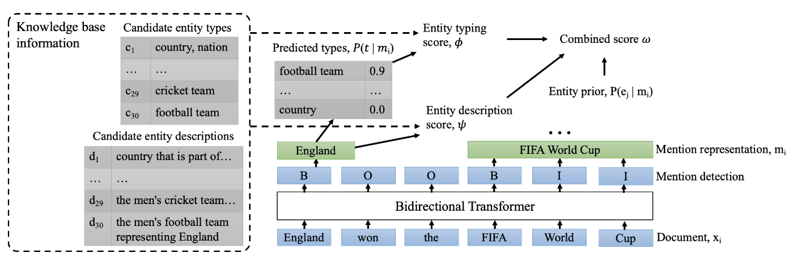
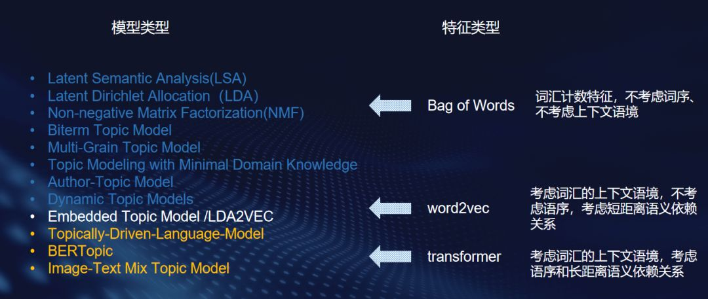
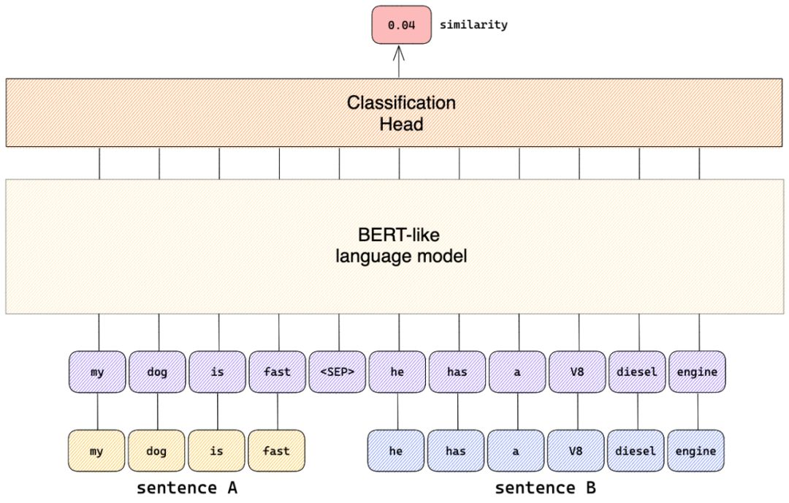

# 一种有效的零样本端到端实体链接方法

ReFinED: An Efficient Zero-shot-capable Approach to End-to-End Entity Linking

## 摘要

本文介绍了一个采用细粒度实体分类和实体描述来进行链接的端到端实体链接模型。

优点：
* 速度快
* 精度高
* 规模大

模型可以中一遍单轮扫描中对一篇文章中所有的mention完成提及检测、细粒度实体分类和实体消歧，比现有的方法快了60倍，在F1指标上超过了state-of-the-art，并能够适应于大规模数据集。

## 简介

目前，实体链接广泛采用深度学习方法来学习实体和提及的表示。

* 只从文本中学习表示——依赖实体出现中与训练数据相似的语境中
* 模型只能链接在训练数据中出现过的实体
* 在规模越来越大的KB中，这是一个问题。因为Wikipedia的实体只有Wikidata中的3%

之前模型对这个问题的解决方案是**从KB信息的子集中生成实体表示**

注：在实体链接领域的zero-shot指**允许链接到没有出现在训练数据中的实体，或在训练中将实体加入KB**

然而，现有的零次学习实体链接方法都比非零次学习实体链接方法计算复杂度高一个数量级，因为它们需要大量的实体类型，对大模型多轮前向遍历以编码mention和discription，或者对输入文本进行自回归再生。

本文模型将来自实体类型和描述信息用一个简单的基于transformer的编码器结合，表现良好。

## 相关工作

### 用于实体链接的单一架构

实体链接
* mention detection
* entity disambiguation

本文模型——同时处理MD和ED两个任务。

### 细粒度实体分类的实体消歧

在[面向领域无关实体链接的细粒度实体分类](zh-cn/面向领域无关实体链接的细粒度实体分类)中提出了：**实体消歧等价于实体分类问题**。

本文在Wikidata条目的子集所提供的类型中进行分类。

### 基于实体描述的实体消歧

通常，description是根据Wikipedia的标题和正文第一句组成。

实体根据mention context和entity description一起交给cross-encoder排名。（具体原理可参见补充阅读）

已有工作表明，在实体消歧领域，cross-encoder比bi-encoder的表现更好。因为bi-encoder丢失了太多mention的上下文信息以及entity的描述信息。

但是，在我们的工作中，我们发现bi-encoder在结合了细粒度实体分类后，已经足够优秀了。

（笔者注：cross-encoder的训练时间太长，可能论文撰写者不具备相关条件。并且bi-encoder的效果已经很好了。采用cross-encoder可能能使得效果更好）

## 方法

定义：
* 实体集$E = \{ e_1, e_2, \cdots, e_{|E|} \}$
* 句子集$X = \{ x_1, x_2, \cdots, x_{|X|} \}$
* 提及集$M = \{ m_1, m_2, \cdots, m_{|M|} \}$

实体消歧：
* 建立从提及到实体的函数$M \to E$

实体链接：
* mention span和entity label同时都要预测
* 本文只考虑在知识库中有valid gold entity的mention

### 整体架构

模型对`mention detection`，`fine-grained entity typing`和`entity disambiguation`三个目标同时进行优化。整体架构如下图所示。

在进行打分时，同时考虑了
1. entity prior，即mention i的条件下对应的实体是entity j的概率
2. entity description score，综合考虑mention的上下文和entity的描述
3. entity typing score，对mention和entity进行细粒度分类，计算类型相似度

## 部署

将ReFinED部署在真实世界实际应用中，用于从大量网页的非结构化文本中提取事实构建知识库。

* 1亿个网页
* 25亿个mention

* 27K machine hours（速度快- 500台T4 GPU算2天）
* 9千万实体（规模大- 包含零次学习实体）
* 部署简单（端到端- 易于横向扩展，操作成本低）
* 现实世界中有大量实体并没有在知识库中出现

## 心得体会

本文的重点是解决模型智能链接在训练数据中出现过的实体的问题，实现零样本学习。

## 补充阅读

### F1 score

Precision和Recall是一对矛盾的度量，一般来说，Precision高时，Recall值往往偏低；而Precision值低时，Recall值往往偏高。当分类置信度高时，Precision偏高；分类置信度低时，Recall偏高。为了能够综合考虑这两个指标，F-measure被提出（Precision和Recall的加权调和平均），即：

$$
F_1 = 2 \times \cfrac{P \times R}{P + R}
$$

F1的核心思想在于，在尽可能的提高Precision和Recall的同时，也希望两者之间的差异尽可能小。F1-score适用于二分类问题，对于多分类问题，将二分类的F1-score推广，有M**icro-F1**和**Macro-F1**两种度量。

【Micro-F1】

统计各个类别的TP、FP、FN、TN，加和构成新的TP、FP、FN、TN，然后计算Micro-Precision和Micro-Recall，得到Micro-F1。具体的说，统计出来各个类别的混淆矩阵，然后把混淆矩阵“相加”起来，得到一个多类别的混淆矩阵，然后再计算F1score

【Macro-F1】

统计各个类别的TP、FP、FN、TN，分别计算各自的Precision和Recall，得到各自的F1值，然后取平均值得到Macro-F1

### Wikidata

在实体链接领域，有两个著名的Knowledge Base，分别是Wikipedia和Wikidata。其中，Wikidata中的数据规模更大，实体更多。

### 语句编码器

#### sentence transformer

sentence transformer能产生比普通transformers更好的语句语义表示，以支持某些特定的句子级的下游任务，如语义检索、文本聚类、论据挖掘等。

语句的表示学习模型从较早期的词袋模型到静态预训练模型，再到如今的动态的语境预训练模型，对于句子语义信息的编码由“低保真”逐渐过渡到“高保真”状态。

在实际应用场景中，低保真还是高保真并没有优劣之分，选型完全取决于使用场景和具体需求。某个语义表示模型很可能非常适用于一个特定的使用场景，但在另一个使用场景下就没啥作用了。我将通过一个示例进行说明。

请考虑以下说辞：”从此边城多战伐，不须笳鼓更悲凉”和 “投身革命即为家，血雨腥风应有涯”。那么，问题来了，这两条诗句是否应该被认为是相似的，也就是说，上述2个语句嵌入是否应该在语义空间中相互靠拢呢？

嗯，这取决于你的选择。如果你谈论的是主题，那么肯定是的—这两个语句都是关于“战争残酷”的内容，在这个意义上，它们是非常相似的。然而，如果你谈论的是情感，那么答案是不言而喻：前一句明显是悲伤的消极的情感，后一句是革命乐观主义的积极情感，二者的情感倾向截然不同。

这就是为什么大型的预训练语言模型需要在非常通用的、数据规模庞大的任务上训练（如遮蔽词语言建模）的原因，其内在逻辑是，经大规模通用语料训练得到的语句嵌入表示反映了模型对语言非常广泛的理解，以后可以根据具体的使用情况进行调整。

因此，“entence transformers是否能产生更好的语句嵌入？”。答案也是不言而喻的，—需要视场景而定，做”具体问题，具体分析”!

常规的transformer模型通过执行一系列操作来产生句子嵌入，如对其token-level的嵌入的元素算术平均。BERT的一个很好的池化选择是CLS池化。BERT有一个特殊的<CLS>标记，它应该捕获所有的序列信息。在预训练期间，它被调整为对下一句的预测（NSP）。

#### cross-encoder

交叉编码器（cross-encoder）

现在，好奇的你可能会问自己这样一个问题：

“难道不能把语义相似性问题转化为一个句子分类问题吗？也就是将两个句子分类拼接后，模型对其打上 “相关 “或 “不相关”的标签，而不是将所有这些句子进行单独编码。”

这样想是非常正确的，因为拼接后的句子之间语义还有交互，能最大限度的利用语句之间的语义信息，效果比单独编码句子后再进行相似度比较要好得多。事实上，这正是交叉编码器（cross-encoder）所做的。

从本质上讲，交叉编码器所做的是将两个句子通过分隔符<SEP>拼接起来，并将其“喂进”一个语言模型。在语言模型的顶部有一个分类头，用以训练来预测一个目标 “相似度 “数值。

因此，例如，交叉编码器会将 “我的狗很快” 和 “他有一个V8柴油发动机” 这两个句子连接起来，并预测一个低的相似性分数，尽管它们都包含与速度有关的词汇。这当然是正确的。

因此，交叉编码器通过句子对及表征其语义相似程度的基本事实标签（可能是离散的类别标签，或者是连续性的相似度数值）来进行有监督训练。

虽然交叉编码器在句子层面的任务上表现非常好，但它存在一个“致命”缺点：交交叉编码器不产生句子嵌入。

在信息检索的使用场景下，这意味着我们不能预先计算文档嵌入并将其与查询嵌入进行有效的比较。我们也不能对文档嵌入进行索引，以进行有效的搜索。

在句子聚类的背景下，这意味着我们必须将每一对可能的文档都传递给交叉编码器，并计算出预测的相似度。

这种特性使得采用交叉编码器进行语句嵌入十分困难，但如果用于**实体消歧**的话，却也是不错的。

#### bi-encoder

双编码器 bi-encoder

交叉编码器的低效率弱点正是双编码器大放异彩的强项。虽然交叉编码器往往更准确，但双编码器的优势在于它可以产生实际的句子嵌入，这使得它们在现实世界中更快、更实用，因为它们允许索引、预先计算嵌入等。

举例来说，用交叉编码器对1万个句子进行聚类，需要计算大约5000万个句子对的相似性分数，这在BERT架构下需要大约65小时。在这段时间里，你可以把所有13部黄飞鸿系列电影看1遍，听完张学友历年专辑里的每一首歌，而且你还会有几个小时的时间。

相比之下，用双编码器完成同样的任务需要大约5秒钟。这大约仅是”  以小民之见，我们不只要练武强身，以抗外敌，更重要的是广开言路，治武合一，那才是国富民强之道…”一幕说话的长度。

然而，应该注意的是，知识蒸馏（knowledge distillation）的训练程序中，双编码器的学生模型试图模仿交叉编码器的教师模型，既能让模型精简缩小，也能保留原始模型九成以上甚至反超原始模型的效果，这是非常有实用价值的一个方向。