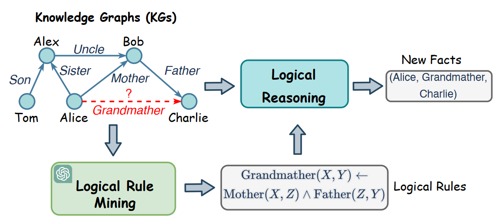

# 以大语言模型之力，寻知识图谱之迹

——挖掘知识图谱推理逻辑规则的又一新篇

## 摘要

逻辑规则对于发现关系中的潜在逻辑连接十分重要，能够提升知识图谱的推理性能和提供可解释的结果。

虽然已经有许多方法应用于挖掘知识图谱中的逻辑规则，但现有方法深受在规则空间中密集计算搜索的困扰，使其难以在大规模知识图谱中应用。此外，这些方法通常忽略了在发掘逻辑连接中很重要的关系的语义。

现有方法的不足
* 采用搜索策略，计算量过大，难以在大规模知识图谱中应用
* 忽略关系自身语义

本文借助大语言模型的力量挖掘逻辑规则。
* 采用基于LLM的规则生成器初始化，同时利用知识图谱的语义信息和结构信息来提示LLM生成逻辑规则
* 通过结合已有的知识图谱对规则进行排序，以此来对规则生成进行精细化调优
* 最后，一个规则验证器来约数LLM的推理并基于思维链来验证逻辑关系

## 介绍

定义
* 知识图谱：以结构化格式存储真实世界知识
* 图谱推理：从现有事实中推导新的知识

背景
* 可解释性知识图谱推理能够帮助用户理解推理过程、增加可信度，在医学诊断、法律裁决中有重要作用

示例

* 在上图中，我们知道逻辑规则 GrandMather(X, Y ) ← Mother(X, Z) ∧ Father(Z, Y )，可以用其预测知识图谱中所缺失的 Grand-Mather 关系的事实。

因此，逻辑规则（logical rule）的挖掘在推理中非常重要。

早期关于逻辑规则挖掘的研究通常通过发现KG结构中**频繁出现的模式**来找到逻辑规则。然而，它们通常需要枚举KG上所有可能的规则，并**根据估计的重要性对其进行排序**。

尽管最近的研究提出使用**深度学习方法对规则进行排序**。这些方法仍然受限于对规则的穷举，无法扩展到大规模KG。 

最近一些方法解决了这一问题，它们从KG中抽取路径，并对其进行模型训练，以捕捉形成规则的逻辑联系。但是，他们通常忽略了关系语义对表达逻辑联系的贡献。

例如：
我们知道一个人的"父亲"的"母亲"是他的"祖母"，据此以定义一条规则，如GrandMather(X,Y)←Mother(X,Z)∧Father(Z,Y)来表达逻辑联系。然而，**由于KG中的关系数量众多，要求领域专家为每个关系注释规则可能会造成负担**。因此，必须自动结合关系的结构和语义来发现KG中的逻辑规则。

最近，大型语言模型（LLM）凭借其突现能力和泛化能力，在自然语言处理领域和各种应用中表现出了令人印象深刻的性能。**经过大规模语料库的训练，LLMs存储了大量常识性知识，可用于促进KG推理，但LLMs并非为理解KG的结构而设计，因此很难直接应用它们来挖掘KG的逻辑规则。**此外，公认的幻觉问题也会使LLM生成毫无意义的逻辑规则。

## 总结

这篇文章将两者进行结合，利用大模型挖掘知识图谱上的逻辑规则，利用LLM的重读能力和KG的结构信息进行规则生成、规则排序和规则验证。

## 补充阅读

### 知识图谱推理规则挖掘

进行知识图谱推理规则挖掘，基本思想很简单，给定种子规则，针对规则来生成进一步的规则候选，然后利用打分函数对规则进行打分排序，最终形成最终的挖掘结果。

为了从KG中自动发现有意义的推理规则，逻辑规则挖掘在研究界获得了极大的关注。

#### 传统的推理方法

传统方法的核心在于列举候选规则，然后通过计算权重分数来判断规则的质量。

例如：

* AIME，一种传统的逻辑规则挖掘方法，它通过归纳逻辑编程从KG中发现规则；
* NeuralLP，一种归纳逻辑编程方法，它以端到端的差分方式学习逻辑规则；
* DRUM，利用LSTM和注意力机制扩展了NeuralLP，以挖掘可变长度的规则；

随着深度学习的发展，研究人员探索了以不同方式同时学习逻辑规则和权重的想法，然而，这些方法仍然要对规则空间进行大量优化，这限制了它们的可扩展性。

#### ChatRule

ChatRule的路线也类似，该框架利用KG的语义和结构信息促使LLM生成逻辑规则。具体的：

首先提出一种基于LLM的规则生成器，为每个关系生成候选规则，从KG中抽取一些路径来表示结构信息，然后将其用于精心设计的提示中，从而利用LLM的能力进行规则挖掘。

为了减少幻觉问题，设计了一个逻辑规则排序器来评估生成规则的质量，并通过囊括KG中观察到的事实来过滤无均值规则。在逻辑推理阶段进一步使用质量分数，以减少低质量规则的影响。

最后，为了去除由KG支持但逻辑上不正确的虚假规则，利用LLM的逻辑推理能力，通过思维链（CoT）推理用规则验证器验证规则的逻辑正确性。