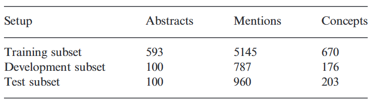
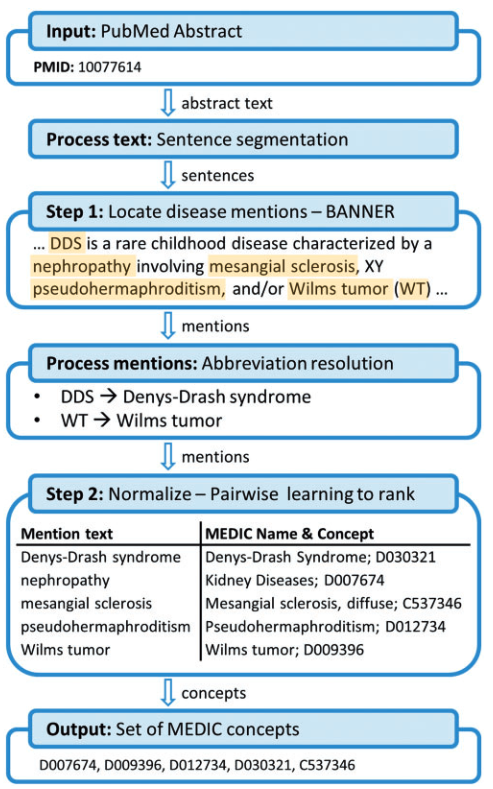
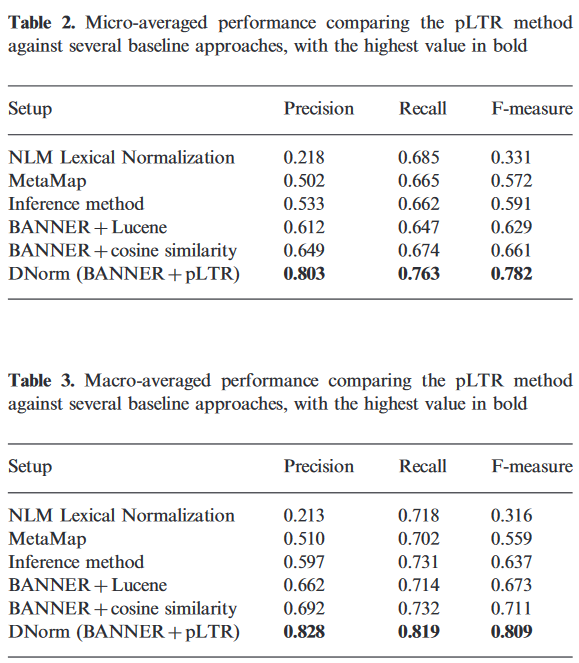
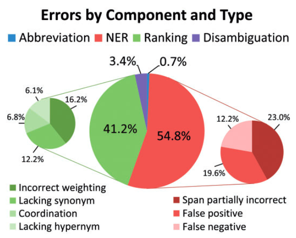

# 利用成对学习排名进行疾病名称标准化

DNorm: disease name normalization with pairwise learning to rank

## 动机

疾病词的标准化（Disease Name Normalization）是一个非常复杂的任务，疾病词通常是由希腊和拉丁的词根和词缀构造的，比如hemochromatosis（血色素沉着病）。另一种灵活的疾病词创建方式是疾病分类（disease category）加上短修饰词（modifier），其中包括：

* 解剖部位（anatomical locations ）。比如breast cancer，乳癌
* 症状（symptoms ）。比如cat-eye syndrome，猫眼综合征
* 治疗方案（treatment ）。比如Dopa-responsive dystonia，多巴反应性肌张力失常
* 病原体（causative agent）。比如staph infection，葡萄球菌感染
* 生物分子病因（biomolecular etiology ），比如G6PD deficiency，葡萄糖-6-磷酸脱氢酶不足
* 基因特征（heredity ），比如X-linked agammaglobulinemia，X连锁无丙种球蛋白血症
* 人名命名（eponyms），比如Schwartz-Jampel syndrome，Schwartz-Jampel综合征
* 程度描述，比如severe malaria， 严重疟疾

当疾病词在文本中出现的时候，有很多简写，形态变换，词顺序变化和同义词。这些都给疾病标准化带来了困难。另外有可能一个词代表多个意思，比如oculocerebrorenal（眼脑肾的），包含眼、脑、肾三个解剖部位，所以有可能一个修饰词会跟多个标准概念对应。

传统方法多是基于字符串匹配的方法，泛化能力不强。本文首次提出了一种机器学习的方法进行疾病词标准化，这个模型叫做DNorm。这个模型的基本思想是pairwise learning to rank (pLTR)，也就是比较文本中发现的mention和知识库中的实体概念相似性并进行打分排序。

## 方法

### 数据集

使用NCBI disease corpus数据集，其中有793个PubMed摘要，摘要中的疾病词由人工标注出来，并连接到MEDIC疾病词表上。MEDIC, 包含11583个MeSH疾病词和3990个OMIM疾病词，共计13 339个疾病概念，75761个疾病名称，其中包括同义词。

### 模型

#### 系统架构

模型的流程上图所示，输入是一篇摘要，首先进行句子分割，然后使用BANNER进行命名实体识别（NER），找出疾病mention，然后缩写词扩充，并进行预处理，去掉标点符号，转换小写，词干化。这样第一步就完成了，得到若干mention。

第二步使用pLTR对每个mention生成候选集，将mention和标准实体都向量化，使用设计好的打分函数进行打分。

最后返回分数最高的候选词或者返回能够在词表中完全匹配的候选词。

#### Pairwise learning to rank

使用TF-IDF对mention和标准概念进行向量化，并使用如下打分函数计算一对文本之间的分数：

$$
\text{score}(m,n) = m^T W n = \sum_{i, j = 1}^{|T|} m_i W_{ij} n_j
$$

其中矩阵W是一个需要训练的参数，其物理含义代表词和词之间的相关性矩阵，使用合页损失函数进行训练。

#### 训练技巧

$$
W = \argmax_W \sum_m \sum_{n^+} \sum_{n^-} \max (0, 1 - m^T W n^+ + m^T W n^-)
$$

* W是需要优化的参数，使用合页损失函数作为优化目标。一般情况下，使得正样本分数大于负样本。当正样本的分数与负样本分数之差小于1时候，计算梯度，更新参数值。
* 对W进行初始化，使用单位矩阵（identity matrix）
* 参数的数量是 |tokens|的数量的平方，这个参数的数量很大，容易过拟合。
* 在训练时候，正样本只选取人工标注的样本，尽管有同义词，但是不作为正样本训练，这是因为想让人工标注的正样本的分数最高。
* 对于析取式（disjunction），有两个映射结果的,作为两条正样本进行训练

## 结果

### 实验结果

baseline模型作者使用了三个：

NLM Lexical Normalization。先使用Norm工具对字符串预处理，再去MEDIC匹配最长的概念
MetaMap。它能将文本中的短语自动映射到UMLS概念，然后再映射到MEDIC概念
Inference method。基于Lucene 搜索，构建映射规则将mention映射到概念
同时作者还将pLTR进行了替换，使用Lucene和cosine similarity进行对比，实验表明DNorm明显高于baseline，而且pLTR是一种非常有效的打分函数，矩阵能够学习到词与词之间的相关性。

### 错误分析

如上图所示NER错误占54.8%，这块是由于BANNER的错误，缩写和消歧错误占比也比较少不再讨论，重点看Ranking的错误。

Ranking的错误占41.2%，其中12.2%是因为同义词关系的缺失，比如cardiac（心脏的）跟heart同义词，colorectal（结直肠的）代表colon（结肠）和rectum（直肠）。还有一些拼写不同的同义词，比如tumour和tumor。还有一些词干化的错误，比如adrenocorticotropic’ stems to ‘adrenocorticotrop-’ but ‘adrenocorticotrophin’ stems to ‘adrenocorticotrophin’。

未识别的上义词（hypernyms）错误占了其中6.1%，这是因为在标注的时候标注人员被要求当mention没有精确匹配的时候讲其标注到上位词。比如hypomania（躁狂症）是一种mood disorder（精神疾病），又比如disorder of glycoprotein metabolism（糖蛋白代谢紊乱）是一种inborn metabolism error（先天性代谢错误）。

另一种错误是mention对应多个概念（coordination），这种错误占比6.8%，比如leukemia and/or lymphoma（白血病和/或淋巴瘤）应该映射到两个概念leukemia（白血病）和lymphoma（淋巴瘤），比如breast, brain, prostate and kidney cancer对应多个解剖部位的癌症。

最后一种错误是打分函数权重不对造成的，这个占比最大，16.2%。比如ptosis（上睑下垂）应该映射到eyelid ptosis（眼睑下垂）而不是X-linked ptosis（X连锁上睑下垂）。映射到后者的原因是X-linked出现频率比eyelid高，导致X-linked的TF-IDF分值比较低，所以它的出现对结果影响不大。另一个例子是adenomatous polyps（腺瘤性息肉）被映射到adenomatous polyposis coli（腺瘤性结肠息肉病）而不是同名的adenomatous polyps。这是因为打分函数发现polyps（息肉）跟adenomatous polyposis coli中每个词都密切相关。

总体来看DNorm在公开数据集上NCBI disease上F1达到0.78，还有很大的提升空间。作者在疾病词的来源和模型的错误分析上做了详细的分析，相信这一点能给研究者带来很多的启发。
