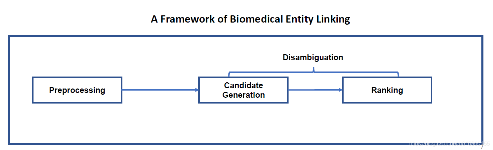
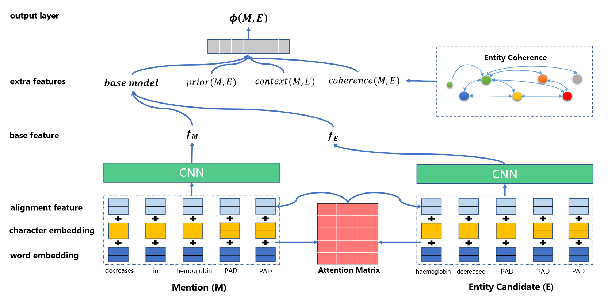
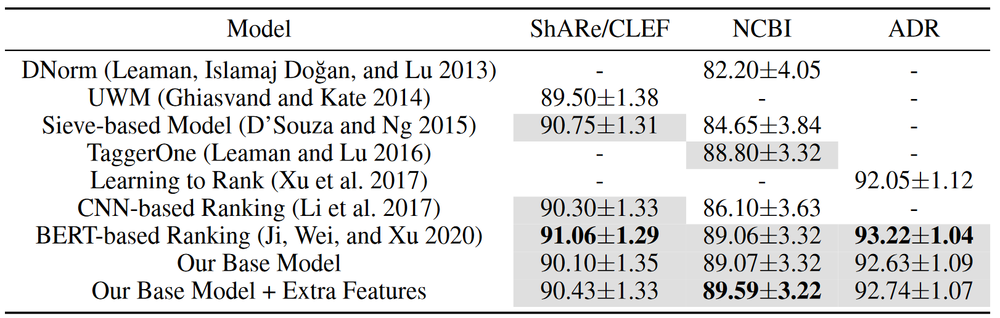

# 医疗实体链接轻量级神经网络模型

A Lightweight Neural Model for Biomedical Entity Linking

## 引言

医疗实体链接 (Biomedical Entity Linking) 把文档中发现的疾病、药物、手术名词（mention）映射到知识库（knowledge base）中的标准术语词。

这项任务其实是非常有挑战的，这是因为文档中出现的医疗词语存在着多种变化，比如缩写、同义词、词形态变化、词序、错别字等。

其次，知识库中的标准术语集规模不算小，少的几万个术语，多的几十万个。更麻烦的是，这些术语长得还非常像，难以区分。

最后，医疗知识库不像传统的知识库WikiData和YAGO，术语（或实体）的信息只有一个实体名字，像实体描述、实体属性等待信息都是没有的，这给医疗实体链接带来了很大的难度。

最近BERT模型在NLP各个任务上都取得了惊人的成绩，也有人使用它在这个任务上进行了尝试，也取得SOTA的结果。

但是BERT模型上百万的参数在某种程度上也限制了它在资源受限（resourece-limted）场景下的使用。

因此，作者提出了一个想法，是否能使用一个简单的模型解决这个问题，而且在准确率上又差的不多呢？

 

这篇论文就是从这个问题出发，具体来说这项工作贡献如下：

1. 作者提出了一种简单而有效神经网络模型，在三个医疗实体链接任务上，这个模型与BERT在统计上并无显著差异
2. 这个模型比BERT小**23倍**，推理时间少**6.4倍**
3. 除此之外，作者还探索如何在这个任务上使用额外特征，其中包括先验知识（Prior）、上下文（Context）、实体一致性（Coherence）

## 方法

模型的框架图如上所示，首先进行预处理，将mention和实体名称转化成统一的格式，然后再从知识库中找到top-k个候选实体，最后对这些实体进行排序输出得分最高的一个作为这个输入mention的标准术语。

上图是文章中的排序模型，作者首先使用预训练word embedding表示单词，然后为了解决out-of-vocabulary和错别字的问题，增加了character embedding。

Alignment Layer用来捕捉另一个文本中相似的部分，使用交互的信息进行表示每个文本，这样能够丰富单个文本的表示，很大程度提升模型的能力。

然后使用一个CNN层去提取关键特征，最后将两个文本的表示拼接在一起送入一个两层的全连接网络，这样就能计算出一个base score了。

除此之外，这个模型还可以加入先验信息、上下文信息、一致性信息。

## 实验

数据集
* NCBI disease
  * 链接：https://www.ncbi.nlm.nih.gov/CBBresearch/Dogan/DISEASE/
  * 下载：http://ctdbase.org/downloads/#alldiseases
* ShARe/CLEF eHealth 2013 Challenge
  * 链接：https://physionet.org/content/shareclefehealth2013/1.0/
  * 下载：https://www.nlm.nih.gov/pubs/techbull/mj12/mj12_umls_2012aa_release.html
* TAC 2017 ADR
  * 链接：https://bionlp.nlm.nih.gov/tac2017adversereactions/
  * 下载：https://www.meddra.org/

实验结果：

## 心得

在本实验中，其模型结构基本上与BERT结构的实体链接模型相似，但是将BERT模型转换为了CNN神经网络，从而大大减少了模型的参数量和训练时间。
从模型结果上看，所得到的结果与BERT的state-of-the-art相比相差无几，是一个将资源消耗和准确率相权衡的结果。