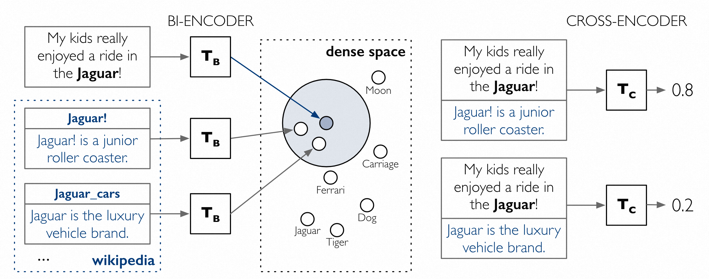
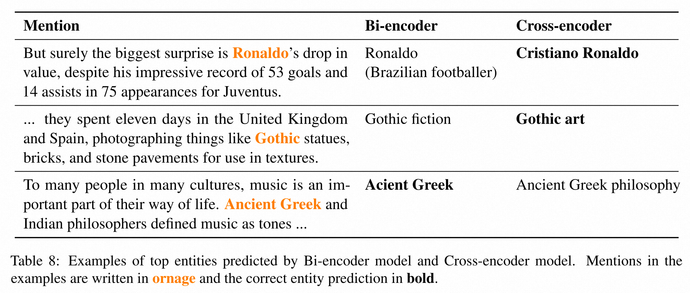

# 可扩展的具备密集实体检索的零次学习实体链接

本文介绍了简单、高效、可扩展的基于BERT的实体链接模型，同时给出对于精度-速度权衡的评估。

我们展示了一个两阶段零次学习实体链接算法，其中每个实体仅需要少量文本描述。

第一阶段在一个由双编码器定义的密集空间中进行检索，该编码器独立地嵌入提及的背景和实体描述。第二阶段用一个交叉编码器对每个候选者进行重新排序，该编码器将提及和实体文本拼接起来。

## 整体框架

首先，输入在所有 实体表示 编码的空间中进行同样的编码。找到与输入编码最为相近的k个实体。之后将这k个实体和输入文本进行交叉编码，得到候选实体的概率。

## 定义与任务

### zero-shot实体链接

zero-shot实体链接的文档设置是相同的，但知识库在训练和测试时是分开的。形式上，表示Etrain和Etest是训练和测试中的知识库，我们要求Etrain∩Etest=∅。在训练和测试中，文本文档、提到的内容和实体字典是分开的，因此在测试时被链接的实体是不可见的。

## 方法论

双编码器使用两个独立的BERT transformer将模型上下文/提及和实体编码为密集向量，每个实体候选者的得分是这些向量的点积。由双编码器检索出的候选者然后被传递给交叉编码器进行排名。交叉编码器在一个transformer中对上下文/提及和实体进行编码，并应用一个额外的线性层来计算每一对的最终得分。

（一些细节这里没有展开，这篇文章中还是用了很多tricky的技巧的。感兴趣可以阅读原文了解）

## 定性分析

表8列出了我们的双编码器和跨编码器模型预测的一些例子，以提供这两个模型如何考虑上下文和提及实体链接的直觉。

在第一个例子中，我们看到双编码器错误地将 "罗纳尔多 "与巴西足球运动员联系起来，而交叉编码器能够使用上下文中的 "尤文图斯 "来消除歧义。在第二个例子中，交叉编码器能够从上下文中识别出该句子是在描述艺术而不是小说，而双编码器却没有做到。在第三个例子中，双编码器能够找到正确的实体 "古希腊"；而交叉编码器却错误地将其与实体 "古希腊哲学 "联系起来，这可能是因为 "哲学家 "这个词出现在上下文中。我们观察到，交叉编码器在利用上下文信息方面往往比双编码器好，但有时也会因为上下文线索的误导而犯错。