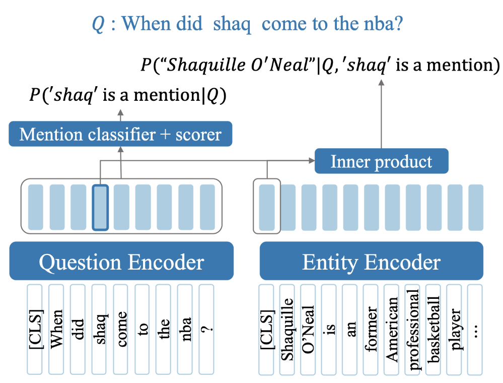
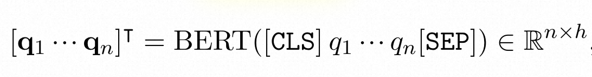
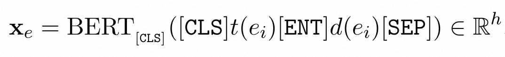
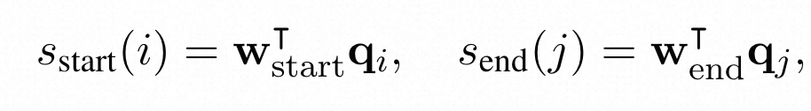
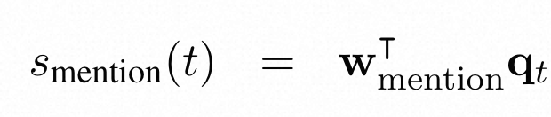
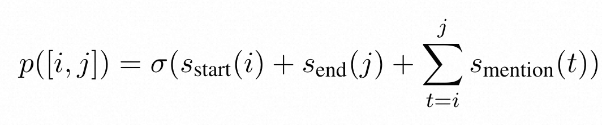

# 基于BERT双编码器的单轮端到端实体链接

## 摘要

本文介绍了一种端到端的针对问句的实体链接模型ELQ，同时实现mention的识别与实体的链接。该方法实现了一个基于BERT的biencoder，识别了问句中的mention并将其链接到Wikipedia中。该方法不仅效率高，而且速度快，在WebQSP和GraphQuestions上达到了SOTA。

论文原文：Efficient One-Pass End-to-End Entity Linking for Questions

## 简介

- 目标：识别给定问题实体的提及边界以及它们在Wikipedia中对应的实体。  
- 方法： 
   - 通过embedding检测mention边界；
   - 基于mention embedding和entity embedding的内积进行消歧 
- 系统架构：



- benchmark：Sorokin and Gurevych（2018）
- 优势：
   - 准确率（提升大约6%）
   - 运行速度（大约比其他神经网络快一倍）

## 问题定义与模型

### 问题定义
对于给定的问题$q$和实体集 $\epsilon = \{ e_i \}$，生成一个tuple的列表$(e, [m_s, m_e])$满足$e$是问题$q$中第$m_s$个token到第$m_e$个token在实体集中所对应的实体。
其中，每个实体来自Wikipedia，有标题t(e_i)和文本描述d(e_i)两个属性，文本描述为Wikipedia的前128个token。

对于输入的长度为n的问题q = q1 q2 ... qn，首先使用BERT得到问题的question token representation

接着对于实体集中的每一个实体，使用BERT计算entity representation


### 提及检测

- 首先计算每一个token作为一个mention的开头或结尾的分数
- 
- 此外计算每个token作为mention的一部分的分数
- 
- 最终，计算candidate span [i, j] 是mention的概率为：
- 

### 实体消歧

- 对于每一个候选的mention [i, j]内的qi ... qj 求平均得到mention representation，然后计算候选mention和候选实体之间的相似分数
- 
- 然后计算在mention [i, j]的条件下各个实体的似然分布
- 

### 模型训练
同时训练提及检测和实体消歧，最小化这两部分的损失之和。采用二元交叉熵作为损失函数。
mention detection部分：


其中，如果[i, j]为gold mention span，则y[i, j]为1，否则为0。而N是我们考虑的所有候选者的数据。

entity disambiguation部分：

其中eg是与mention [i, j]最为匹配的gold entity

**训练技巧**
为了加快训练，采用了**迁移学习**技术。

- 将entity decoder中Wikipedia上采用论文“Zero-shot entity linking with dense entity retrieval”中的方法训练并冻结参数
- 仅仅只在QA数据上训练question decoder

训练时关注难分负样本，由于entity encoder已经固定了，所以可以很快找出难分负样本

注：**难分负样本(hard negatives)**：错分成正样本的负样本，也可以是训练过程中损失最高的负样本

### 模型推理
推理：inference

如图，对于输入的问题q，我们使用mention detection获得mention set集合M，集合中每个候选的概率p均需要大于一个给定阈值gamma
然后根据条件概率分布和mention的概率计算二者同时出现的联合概率，并再次根据阈值筛选

将mention检测和实体消歧结合起来使得可以在实体连接过程中找到多个候选mention

## 实验结果


大意：比目前已有的工作的表现都要好，并且运算时间更短

## 相关工作
模型训练：Zero-shot entity linking with dense entity retrieval
基准baseline：Mixing context granularities for improved entity linking on question answering data across entity categories

## 总结

ELQ不需要事先提供mention边界的代价是枚举所有可能的mention。针对问句，尤其是WebQSP这种非常简短的问句，考虑所有可能的mention的代价是可以承受的。虽然论文最后说期待ELQ未来可以运用在长文本之中，但对于长文本来说，考虑所有可能的mention代价难以承受。因此ELQ的方法可能适用于问句，但不一定能够很好地迁移到长文本上。

## 背景知识

### 词向量 token embedding

Embedding是将如one-hot这样高维度的稀疏矩阵与一个embedding矩阵相乘得到一个稠密的低维矩阵，以降低后续运算的维度。

词向量 (token embeddings) 的作用是将词映射成一个数值向量，而且语义相近的词，在向量空间上具有相似的位置。

#### 查询矩阵和One-Hot编码
Embedding 本质是一个查询矩阵，或者说是一个 dict 数据结构。以词向量为例， Embedding dict 的 Key 是词在词表中的索引位置（Index），Embedding dict 的 Value 是这个词的 dim 维的向量。假设我们的词表只有5个词，我们想把“北京欢迎你”编码为向量。词表一共5个词（Token）（每个字作为一个词）：“北”: 0、“京”: 1、“欢”: 2、“迎”: 3、“你”: 4。每个 Token 都有文字表示和在词表中的索引（Index）。

#### PyTorch实现
深度学习框架都有一个专门的模块来表示 Embedding，比如 PyTorch 中 `torch.nn.Embedding` 就是一个专门用于做 Embedding 的模块。我们可以用这个方法将 Token 编码为词向量。
```python
>>> import torch

>>> embedding = torch.nn.Embedding(num_embeddings=5, embedding_dim=3)
>>> input = torch.LongTensor([1])
>>> print(embedding(input))
tensor([[ 2.0332, -0.8400,  0.8786]], grad_fn=<EmbeddingBackward>)
```
这里 Embedding 的参数中，`num_embeddings` 表示词表大小，即词表一共多少个词， `embedding_dim` 为词向量维度。在当前这个例子中，某个词被映射为3维的向量，经过 Embedding 层之后，输出是 Index 为1的 Token 的3维词向量。

Embedding 里面是什么？是一个权重矩阵：
```python
>>> print(embedding.weight)
Parameter containing:
tensor([[ 1.6697, -0.4804, -0.8150],
        [ 2.0332, -0.8400,  0.8786],   # <-- 刚才获取的 Index = 1 的词向量
        [ 1.5699,  0.0025,  0.4386],
        [-1.1474, -1.3720,  0.9855],
        [ 1.3635, -0.6749, -0.5666]], requires_grad=True)

```
输出是 Embedding 中的权重矩阵，是 `num_embeddings * embedding_dim` 大小的矩阵。
刚才那个例子，查找 Index 为1的词向量 ，恰好是 Embedding 权重矩阵的第2行（从0计数的话则为第1行）。

权重矩阵如何做查询呢？ 答案是 One-Hot 。
先以 One-Hot 编码刚才的词表。

为了得到词向量，`torch.nn.Embedding` 中执行了一次全连接计算：


下面的代码使用 One-Hot 和矩阵相乘来模拟 Embedding :
```python
>>> import torch.nn.functional as F

>>> torch.matmul(F.one_hot(input, num_classes=5).float(), embedding.weight)
```
那么可以看到， Embedding 层就是以 One-Hot 为输入的全连接层！全连接层的参数，就是一个“词向量表”！或者说，Embedding 的查询过程是通过 One-Hot 的输入，以矩阵乘法的方式实现的。
#### 词向量获取
既然 Embedding 就是全连接层，那如何得到 Embedding 呢？Embedding 层既然是一个全连接神经网络，神经网络当然是训练出来的。只是在得到词向量的这个训练过程中，有不同的训练目标。
我们可以直接**把训练好的词向量拿过来用**，比如 Word2Vec、GloVe 以及 Transformer ，这些都是一些语言模型，语言模型对应着某种训练目标。BERT 这样的预训练模型，在预训练阶段， Embedding 是随机初始化的，经过预训练之后，就可以得到词向量。比如 **BERT** 是在做**完形填空**，用周围的词预测被掩盖的词。语料中有大量“巴黎是法国的首都”的文本，把“巴黎”掩盖住：“[MASK]是法国的首都”，模型仍然能够将“[MASK]”预测为“巴黎”，说明词向量已经学得差不多了。
预训练好的词向量作为己用，可以用于下游任务。BERT 在微调时，会直接读取 Embedding 层的参数。预训练好的词向量上可以使用 Cosine 等方式，获得距离和相似度，语义相似的词有相似的词向量表示。这是因为，我们在用语言模型在预训练时，有窗口效应，通过前n个字预测下一个字的概率，这个n就是窗口的大小，同一个窗口内的词语，会有相似的更新，这些更新会累积，而具有相似模式的词语就会把这些相似更新累积到可观的程度。比如，“忐”、“忑”这两个字，几乎是连在一起用的，更新“忐”的同时，几乎也会更新“忑”，因此它们的更新几乎都是相同的，这样“忐”、“忑”的字向量必然几乎是一样的。
预训练中，训练数据含有一些相似的语言模式。“相似的模式”指的是在特定的语言任务中，它们是可替换的，比如在一般的泛化语料中，“我喜欢你”中的“喜欢”，替换为“讨厌”后还是一个成立的句子，因此“喜欢”与“讨厌”虽然在语义上是两个相反的概念，但经过预训练之后，可能得到相似的词向量。
另外一种方式是**从零开始训练**。比如，我们有标注好的情感分类的数据，数据足够多，且质量足够好，我们可以直接随机初始化 Embedding 层，最后的训练目标是情感分类结果。Embedding 会在训练过程中自己更新参数。在这种情况下，词向量是通过情感分类任务训练的，“喜欢”与“讨厌”的词向量就会有差异较大。
#### 应用场景
有了 Embedding ，就可以对词进行向量空间上的各类操作，比如用 Cosine 距离计算相似度；句子中多个词的 Embedding 相加得到句向量。
#### 总结
Embedding 是经过了 One-Hot 的全连接层。除了词向量外，很多 Categorical 的特征也可以作为 Embedding。推荐系统中有很多 One-Hot 的特征，比如手机机型特征，可能有上千个类别。深度学习之前的线性模型直接对特征进行 One-Hot 编码，有些特征可能是上千维，上千维的特征里，只有一维是1，其他特征都是0，这种特征非常稠密。深度学习模型不适合这种稀疏的 One-Hot 特征，Embedding 可以将稀疏特征编码为低维的稠密特征。

### 注意力机制 Attention
#### Attention
 神经网络模型的本质就是对输入文本进行编码，常规的做法是首先对句子进行分词，然后将每个词语 (token) 都转化为对应的词向量 (token embeddings)。
在 Transformer 模型提出之前，对 token 序列 X 的常规编码方式是通过循环网络 (RNNs) 和卷积网络 (CNNs)。

- RNN
   - RNN（例如 LSTM）的方案很简单，每一个词语 xi对应的编码结果 yi 通过递归地计算得到：
   - y_t = f(y_{t-1}, x_t) 
   - RNN 的序列建模方式虽然**与人类阅读类似**，但是递归的结构导致其**无法并行**计算，因此速度较慢。而且 RNN 本质是一个马尔科夫决策过程，**难以学习到全局的结构信息**；
- CNN 
   - CNN则通过滑动窗口基于局部上下文来编码文本，例如核尺寸为 3 的卷积操作就是使用每一个词自身以及前一个和后一个词来生成嵌入式表示：
   - y_t = f(x_{t-1}, x_t, x_{t+1}) 
   - CNN **能够并行地计算**，因此速度很快，但是由于是通过窗口来进行编码，所以更**侧重于捕获局部信息**，难以建模长距离的语义依赖。

Google《Attention is All You Need》提供了第三个方案：**直接使用 Attention 机制编码整个文本**。相比 RNN 要逐步递归才能获得全局信息（因此一般使用双向 RNN），而 CNN 实际只能获取局部信息，需要通过层叠来增大感受野，Attention 机制一步到位获取了全局信息：
$\boldsymbol{y}_t = f(\boldsymbol{x}_t,\boldsymbol{A},\boldsymbol{B})$
其中 A,B 是另外的词语序列（矩阵），如果取 A=B=X 就称为 Self-Attention，即直接将 xt 与自身序列中的每个词语进行比较，最后算出 yt。
#### BERT
BERT的全称为Bidirectional Encoder Representation from Transformers，**基于变换器的双向编码器表示技术**，是一个预训练的语言表征模型。它强调了不再像以往一样采用传统的单向语言模型或者把两个单向语言模型进行浅层拼接的方法进行预训练，而是采用新的**masked language model（MLM）**，以致能生成**深度的双向**语言表征。


#### 参考资料
[第三章：注意力机制 · Transformers快速入门](https://transformers.run/back/attention/)

### 迁移学习
#### 概念介绍
迁移学习(transfer learning)通俗来讲，就是**运用已有的知识来学习新的知识**，核心是找到已有知识和新知识之间的相似性，用成语来说就是举一反三。
由于直接对目标域从头开始学习成本太高，我们故而转向运用已有的相关知识来辅助尽快地学习新知识。比如，已经会下中国象棋，就可以类比着来学习国际象棋；已经会编写Java程序，就可以类比着来学习C#；已经学会英语，就可以类比着来学习法语；等等。世间万事万物皆有共性，如何合理地找寻它们之间的相似性，进而利用这个桥梁来帮助学习新知识，是迁移学习的核心问题。
具体地，在迁移学习中，我们**已有的知识**叫做**源域(source domain)**，要学习的**新知识**叫**目标域(target domain)**。迁移学习研究如何把源域的知识迁移到目标域上。特别地，在机器学习领域中，迁移学习研究如何将已有模型应用到新的不同的、但是有一定关联的领域中。传统机器学习在应对数据的分布、维度，以及模型的输出变化等任务时，模型不够灵活、结果不够好，而迁移学习放松了这些假设。在数据分布、特征维度以及模型输出变化条件下，有机地利用源域中的知识来对目标域更好地建模。另外，在有标定数据缺乏的情况下，迁移学习可以很好地利用相关领域有标定的数据完成数据的标定。

#### 域适应
domain adaptation是迁移学习原先就有的概念，在研究source domain和target domain时，基于某一特征，会发现两个domain的数据分布差别很大，比如说选择某一区域的颜色信息作为图像特征，下图红线表示source dataset的颜色信息值分布，蓝线表示target dataset的颜色信息值分布，很明显对于这一特征来讲，两个域的数据本来就是有shift的。而这个shift导致我们evaluate这个模型的时候准确率会大大降低。

