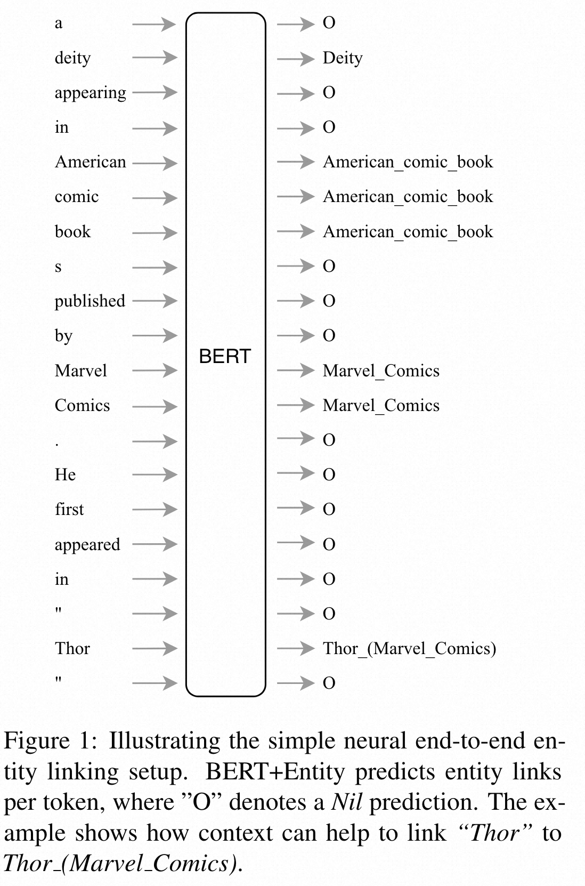

# 基于BERT的端到端实体链接

通过简单神经网络端到端实体链接研究BERT中的实体知识

Investigating Entity Knowledge in BERT with Simple Neural End-To-End Entity Linking

## 简介

### 实体链接简介

实体链接的三个阶段

* Mention Detection， MD
* Candidate Generation，CG
* Entity Disambiguation，ED

三个阶段相互依赖，联合建模将更为有利。MD，CG的质量决定了实体链接的上限

### BERT

BERT是一种采用大量语言数据预训练的深度自注意力结构，适用于多种NLP任务。

### 本文目标

* BERT是否能够同时学习实体链接中的各个阶段的任务？
  * 建立了一个在整个词汇表上的逐词分类链接任务
    * entity：700K英语维基百科中最常用的词组
    * mention：句子中的每一个token，即每一个词
    * 模型BERT+Entity有非常好的效果，仅有3%的错误率

* 在预训练的BERT中已经包含了多少的实体知识？
  * Frozen-BERT+Entity正确率比BERT+Entity低了6%

