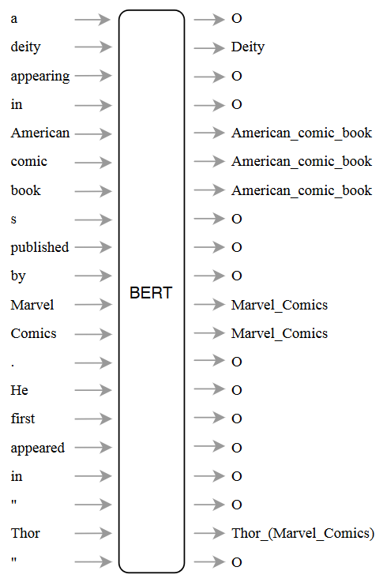

# 基于BERT的端到端实体链接

通过简单神经网络端到端实体链接研究BERT中的实体知识

Investigating Entity Knowledge in BERT with Simple Neural End-To-End Entity Linking

## 简介

### 实体链接简介

实体链接的三个阶段

* Mention Detection， MD
* Candidate Generation，CG
* Entity Disambiguation，ED

三个阶段相互依赖，联合建模将更为有利。MD，CG的质量决定了实体链接的上限

### 本文目标

* BERT是否能够同时学习实体链接中的各个阶段的任务？
  * 建立了一个在整个词汇表上的逐词分类链接任务
    * entity：700K英语维基百科中最常用的词组
    * mention：句子中的每一个token，即每一个词
    * 模型BERT+Entity有非常好的效果，仅有3%的错误由跨度错误造成，绝大多数错误是Nil预测造成的。

<!--  -->

* 在预训练的BERT中已经包含了多少的实体知识？
  * 冻结BERT参数，仅在Wikipedia上训练原模型的entity classifier
  * Frozen-BERT+Entity正确率比BERT+Entity低了6%

* 额外的实体知识会提高 BERT在下游任务的表现吗？
  * 由于模型被迫为每个词分配实体提及，下游任务可能可以利用这一点
    * 自然语言理解基准GLUE
    * 问答基准SQUAD V2和SWAG
    * 机器翻译基准EN-DE WMT14
  * 实验结果表明，BERT对这些任务没有帮助

## 相关工作

- 实体链接
  - 已有的工作表明将实体链接中的几个环节联合考虑有利于提高性能
- 预训练语言模型
  - 提供丰富的文本表示，用深度上下文**词嵌入**替换静态词嵌入，进一步训练**finetune**将有帮助

## BERT+Entity

* 主要挑战：设计训练方案，即创造训练数据
    * 利用维基百科内部的链接关系，从维基百科中获取文本数据和实体链接注释。
    * 维基百科中并非每个实体都被链接，这在训练中是不利的。

### 模型

BERT

* 定义：BERT是一种采用大量语言数据预训练的深度自注意力结构，适用于多种NLP任务。

* 训练目标
  * 从句子中预测缺失的token
  * 判断两个句子是否相邻

* 本文模型：BERT-base-uncased模型，并中顶层加了一层输出分类层。

原理：考虑上下文相关的token，分类器对每一个entity vocabulary中的entry计算实体链接的概率。

具体来说，令 
* $d$ 表示BERT的词向量维度
* $E \in R^{|KB| \times d}$ 表示实体分类层，其中$|KB|$是知识图谱KB的实体数量
* $V$ 表示 sub-word 词汇表
* $c_i = BERT(h)[i]$ 表示从上下文$h = [v_1, v_2, \cdots, v_{i-1}, v_i, v_{i+1}, \cdots, v_m]$中第i个词BERT计算的结果
* $\sigma(E_j c_i)$ 表示上下文$h$中词$v_i$被链接到实体$j$的概率 $p(j | v, h)$。这里$\sigma$是sigmoid函数

### 训练数据

* 数据来自英文维基百科文本
* 采用WikiExtractor的扩展版本提取与维基百科内部超链接相关的text span作为标注。
* 收集潜在可链接$(m, e)$元组集合$M$，并让我们能够根据$(m, e)$的出现次数$#(m, e)$计算条件概率$p(e|m)$

### 不完整标记处理

采用Wikipedia的超链接标记最大的问题是，这种方法下大多数实体都没有对所有的提及进行标注。往往只有文章中第一次出现才有链接。

## 背景资料

### 文本表示

Text representation是文本挖掘和信息抽取中的一个重要问题。它旨在将非结构化的文本文档数字化展示来使得文档可以被计算。

* 单词表示 word representation
  * one-hot representation
* 句子表示
  * boolean-based representation
    * 基于一个词是否出现过进行组合，不考虑词频
  * count-based representation
    * 考虑词频的向量
  * TF-IDF representation: $tf-idf(w) = tf(d,w) * idf(w)$
    * TF：文档document中词语w出现的词频
    * IDF：$\log \frac{N}{N(w)}$，语料库中文档总数处理词语w出现文档数的对数
