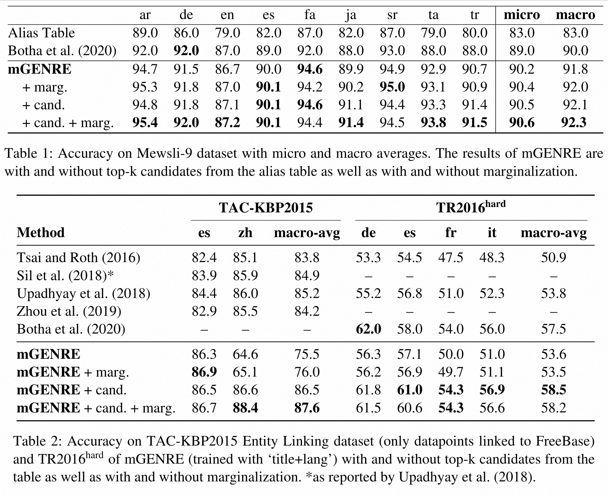
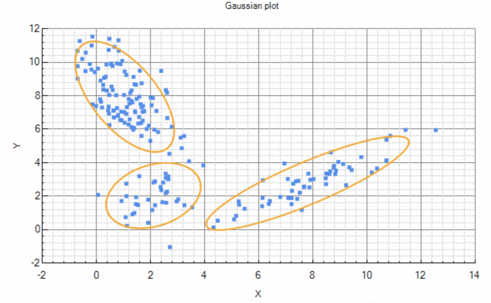

# 多语言自回归实体链接

Multilingual Autoregressive Entity Linking

## 摘要

定义：多语言实体链接——将一个特定语言的mention链接到一个多语言的Knowledge Base中。

行为：对于一个给定语言的mention，mGENRE将以自回归的方式从左到右逐词预测目标实体的名称。

优势：
* 有效地交叉编码提及的字符串和实体名称，以获取提及和实体向量之间更多的互动。
* 可以在一个大的数据库中快速搜索，即使是那些没有出现在提及表中的提及，也不需要大规模的向量索引。
* 在完全没有训练数据的语言中，mGENRE将目标语言作为一个潜在的变量，在预测时将目标语言边缘化，让平均准确率提高了50%以上。

## 简介

* 多语言实体链接
  * 长期以来是将一种语言的mention链接到另一种语言（通常是英语）的entity中。
  * 定义一个语言无关的KB能够更好适应多语言，考虑英文没有单其他语言具备的实体描述能力。
    * 大多数解决方案选择提供给一个**统一的实体表示**，或者将多语言描述整理成**一个向量**。

* 本文发现
  * 由于不同语言的源语言和实体名称之间的联系，**保持尽可能多的语言信息**，从而为每个实体提供多种表示方法，是有帮助的。
  * **将所有可用的语言作为目标**，并对可能的选择进行汇总，是处理没有训练数据的源语言的zero-shot设置的有效方法。

* 本文贡献
  * 提出了第一个采用用seq2seq的架构，以自回归的方式逐个token生成100多种语言的实体名称，并以上下文为条件的**多语言实体链接系统mGENRE**：
    * 考虑KB中每个条目的所有语言来扩展实体名称的目录
    * 设计了一个新的目标函数，对所有的语言进行边缘化处理来进行预测。

## 背景

这部分内容与[采用判别修正的高并行自回归实体链接](zh-cn/采用判别修正的高并行自回归实体链接)中的许多内容多有重合，故简要描述。

### 自回归生成

GENRE通过计算分数对每个e∈E进行排名，自回归公式为：$\text{score} \theta(e|x)= \prod pθ(y|x)=Ni=1pθ(yi|y<i,x)$ 其中y是e的标识符中的N个token序列，x是输入（即上下文c和提及m），θ是模型的参数。GENRE基于微调的BART架构，并使用标准的seq2seq目标进行训练，即用教师强迫法最大化输出序列可能性，并用dropout和标签平滑法进行正则化。

### beam search

用限制性beam search进行排名。在测试时，为E中的每个元素计算一个分数，然后对它们进行排序，成本太高。因此，GENRE利用beam search，这是一个既定的近似解码策略，可以有效地浏览搜索空间。与其明确地对E中的所有实体进行评分，不如使用带有k个beams的BS搜索E中的前k个实体。在解码过程中，BS只考虑提前一步（即它以先前的token为条件生成下一个token）。因此，GENRE采用了一个前缀树（trie）来实现有约束的beam search，然后只生成有效的实体标识。

## 模型

定义与语言无关的实体标识：对于每一个实体建立一个标识符集合$\{<l, n_e^l>\}$，l表示语言，n为Wikipedia上以语言l链接到实体e的表述。

标识符策略
1. 为每个实体设定一个典型的文本标识符（即对每个实体，选择一个特定语言的描述作为它的名字）【一对一映射】
2. 定义一个文本标识符和实体的映射，拼接language ID和实体在此语言下的name。【多对一映射】
3. 将特定语言中的标识符的选择作为一个潜在变量。

### 规范的实体表示

对每个实体，选择一个特定语言的描述作为它的名字。

选择算法【数据驱动的启发式选择】

1. 根据文档内实体e在语言l中出现mention的次数对每个实体各个语言下的name进行排序
2. 选择在语言l中出现e的mention次数最多的名称$n_e^l$

如果排序时两语言出现e的mention次数相同，则选择在所有实体中mention数量更多的语言。

这里，规范名称（canonical name）$n_e$和实体$e$之间是一对一的关系

$$
\text{score}_{\theta}(e | x) = p_{\theta}(n_e | x)
$$

这种方法的缺点是不能利用上下文和实体名称中的词汇重叠（比如马铃薯的entity name是“Potato”，当模型遇到其西班牙语的表示patata时，智能学习其中一个是另一个的翻译）

### 多语言实体表示

为了解决canonical表示的问题，选择预测所有语言的entity name。

将一个语言l的ID和一个实体名称$n_e^l$拼接有两种可选择的分解方法。我们对所有训练数据的分数进行最大化训练：

$$
\text{score}_{\theta}(e | x) = 
  \left\{
    \begin{aligned}
      &p_{\theta} (l | x) \cdot p_{\theta} (n_e^l | x, l) & \text{for 'lang+name'} \\
      &p_{\theta} (n_e^l | x) \cdot p_{\theta} (l | n_e^l, x) & \text{for 'name+lang'}
    \end{aligned}
  \right.

$$

公式说明：
* 前者对应于首先预测语言的分布，然后预测以语言l为条件的标题，而后者则对应于相反的情况。
* 首先预测的条件进行beam search生成较小的集合目标。
* 只有1.65%的entity name需要用语言消歧。
* 在实践中，我们观察到这两种方法在性能上没有区

方法优点：
* 可以充分利用源语言和目标语言的协同作用
* 避免翻译

### 边缘化

与普通生成策略不同，我们将文本视为一个潜在变量（latent variable），并将文本x中识别出实体e的概率作为这个实体名称在所有语言中出现概率之和。

$$
\text{score}_{\theta}(e|x) = \sum_{<l, n_e^l> \in L_e} p_{\theta}(n_e^l, l | x)
$$

优点：边缘化将模型暴露在所有语言之中，且只需要对原模型做很小的改动。

缺点：在训练和推理的代价大，与语言数量成正比。依然可以采用beam search来加速。

### 候选实体选择

* 实体链接系统在context和entity之间交叉编码时通常不会为整个KB的所有实体打分。
* 在打分前，先采用一个更低代价的方法对实体进行选择。
* 虽然mGENRE已经采用了beam search，但我们也进行了实验。

具体来说，候选者的选择是通过一个别名表进行的。利用训练数据，我们建立了一个提及表，其中我们记录了所有实体的索引，这些索引是用来指代它们的名字。此外，我们还使用维基百科的标题作为额外的提及（对那些从未作为链接出现的实体很有用）、重定向、维基数据标签和别名。

## 实验环境

* 数据库：Wikidata
* 数据集：TR2016，TAC-KBP2015，Mewsli-9 MEL
* 在一组语言中训练模型，并尝试中未见过的语言上测试

在所有的实验中，我们没有从头开始训练一个模型，而是对一个在125种语言上训练的多语言模型进行微调。

对于普通的生成策略，我们选择源语言中的名称作为ground truth。当这种实体名称不可用时，我们随机选择5种替代语言，并将它们全部作为数据点。为了进行模型选择，我们从每种语言中随机选择了1k个例子，作为验证集。

## 实验结果

我们报告了mGENRE的结果，包括是否将beam search限制在表中的前几位候选者(Candidate Selection)，以及是否进行了边缘化（Marginalization）。所有这些替代方案在9种语言的微观和macro-average精确度上都超过了F+模型。我们的基础模型（没有候选者或边缘化）在所有语言中的macro-averaged误差减少了10.9%，macro-average误差减少了18.0%。基础模型对候选者没有限制，所以它能有效地在所有∼20M的实体中进行分类。除了英语和德语之外，基础模型在每种语言上的表现都比F+模型好。

我们的mGENRE在未见过的实体（即[0,1]仓）上有更高的准确性（22% vs 8%）。这是因为我们的配方可以利用从源头复制名字，翻译它们或将它们范式化的优势。

## 总结

在这项工作中，我们为多语言实体链接问题提出了一个自回归的表述。对于某一种语言的提及，我们的解决方案从左到右和从token到token生成实体名称。由此产生的系统，mGENRE，在尽可能多的语言中保持实体名称，以利用语言的联系和源提及上下文与目标实体名称之间的相互作用。受约束的beam search解码策略能够在大量的实体名称集合中进行快速搜索（例如，多种语言的整个KB），而不需要大规模的密集索引。我们还设计了一个新的目标函数，对所有可用的语言进行边缘化，以进行预测。我们的经验表明，这种策略在处理没有训练数据的语言时确实有效（即在训练期间从未见过的语言有50%的改进）。总的来说，我们的实验表明，mGENRE在三个流行的多语言实体链接数据集上取得了新的最先进的性能。

## 心得体会

在近来大模型的实体链接中，主要分为使用BERT编码到向量空间和采用生成模型两条路。如果说ELQ是向量空间派的一个极致的话，本文则是生成模型派的又一个巅峰了。

本文的重点是处理实体链接中多语言的链接问题，本文在原有生成模型的基础上新提出了3个方案优化以及一个交叉编码优化，具有一定的借鉴意义。

多语言：
* canonical entity representation
* multilingual entity representation
* marginalization

交叉编码：
* candidate selection

## 补充阅读

### 名词解释：zero-shot

zero-shot learning：零次学习。

Zero-shot learning 就是希望我们的模型能够对其从没见过的类别进行分类，让机器具有推理能力，实现真正的智能。其中零次（Zero-shot）是指对于要分类的类别对象，一次也不学习。

标准定义：利用训练集数据训练模型，使得模型能够对测试集的对象进行分类，但是训练集类别和测试集类别之间没有交集；期间需要借助类别的描述，来建立训练集和测试集之间的联系，从而使得模型有效。

与之相近的概念有one-shot learning，few-shot learning等。

Zero-shot learning 指的是我们之前没有这个类别的训练样本。但是我们可以学习到一个映射X->Y。如果这个映射足够好的话，我们就可以处理没有看到的类了。

One-shot learning 指的是我们在训练样本很少，甚至只有一个的情况下，依旧能做预测。这是如何做到呢？可以在一个大数据集上学到general knowledge（具体的说，也可以是X->Y的映射），然后再到小数据上有技巧的update。

而Few-shot learning是小样本学习。如果训练集中，不同类别的样本只有少量，则成为Few-shot learning.
就是给模型待预测类别的少量样本，然后让模型通过查看该类别的其他样本来预测该类别。比如：给小孩子看一张熊猫的照片，那么小孩子到动物园看见熊猫的照片之后，就可以识别出那是熊猫。

### 自回归生成

AR模型

### 边缘化

#### 边缘化的定义

边缘化是一种通过累加一个变量的可能值以判定另一个变量的边缘分布的方法。这听起来有点抽象，让我们看一个例子。

假设我们想知道天气是如何影响英国人的幸福感的，也就是P(幸福感|天气)。

假定我们具有衡量某人的幸福感所需的定义和设备，同时记录了某个英格兰人和某个苏格兰人所处位置的天气。可能苏格兰人通常而言要比英格兰人幸福。所以我们其实在衡量的是P(幸福感, 国|天气)，即，我们同时考察幸福感和国。

边缘化告诉我们，我们可以通过累加国家的所有可能值（英国由3国组成：英格兰、苏格兰、威尔士），得到想要计算的数字，即P(幸福感|天气) = P(幸福感, 国=英格兰|天气) + P(幸福感, 国=苏格兰|天气) + P(幸福感, 国=威尔士|天气)。

这就是了！边缘化让我们累加一些概率以得到想要计算的概率。一旦我们计算出了答案（可能是单一值或一个分布），我们可以得到所需的性质（推断）

如果你正使用概率图模型，那么边缘化是进行精确推断的一种方法（也就是说，你可以写下你关注的分布的精确数值，例如可以基于分布精确计算的均值）。在这种情形下，边缘化有时和变量消除是同义词。

#### 边缘化的例子

假设我们有4枚骰子：4面骰、6面骰、8面骰、10面骰。

**游戏**

* 我把6面骰和8面骰放在红盒内，4面骰和10面骰放在蓝盒内。

* 我从红盒与蓝盒中分别随机选取一枚骰子，然后把它们放在黄盒内。

* 我从黄盒中随机选择一枚骰子，掷骰子并告诉你结果。

进行游戏之后，结果是3。我们想要回答的问题是：骰子更可能来自红盒还是蓝盒？

**求解**

为了求解这一问题，我们需要给定我们掷出了一个3这一条件后，骰子取自红盒的似然，L(盒=红|掷骰=3)，及相应的L(盒=蓝|掷骰=3)。这两个概率中较高的那个是问题的答案。

那么我们如何计算L(盒=红|掷骰=3)和L(盒=蓝|掷骰=3)呢？

首先，似然和概率的关系如下：

L(盒|掷骰) = P(掷骰|盒)

这意味着，L(盒=红|掷骰=3)这一似然等价于给定骰子来自红盒这一条件，投掷出3点的概率，即P(掷骰=3|盒=红)。同理，L(盒=蓝|掷骰=3) = P(掷骰=3|盒=蓝)。

假定我们选择了一个红盒中的骰子。它可能是6面骰或8面骰（各自有50/50的机会）。假设我选择了6面骰。这意味着我必须从黄色盒子中选中6面骰，然后掷出3。这一情形的概率为：

P(掷骰=3, 骰=6面|盒=红) = 1/2 x 1/6

1/2是因为我有50%的机会从红盒中随机选中6面骰，因为盒中还有一枚8面骰。1/6是因为我有一枚6面骰，因此掷出3点的机会是1/6.

注意上面的答案没有包含从黄盒中选中6面骰的概率。这是因为，在这一情形下，从黄盒中选取6面骰的概率是1（你可能以为它是1/2，因为黄盒内有6面骰和从蓝盒中取出来的骰子）。这是因为我们正在计算的是给定骰子取自红盒的前提下一枚6面骰掷出一个3的条件概率。因此，我们选中黄盒中的另一枚骰子的情形是不可能存在的，因为那一枚骰子原本来自蓝盒。所以给定从红盒中取出骰子这一前提，我们只能从黄盒中选择6面骰，因而我们从黄盒中选中6面骰的概率是1。

类似地，我们可以计算结果为3，而我们实际上从红盒中选择了8面骰的概率：

P(掷骰=3, 骰=8面|盒=红) = 1/2 x 1/8

现在我们已经基本上完成了计算骰子来自红盒所需的计算工作。还记得吗？红盒只包含6面骰盒8面骰，因此我们只需找出骰子是6面或8面的概率。这一“或”情形下，我们需要将概率相加。因此，骰子来自于红盒的概率为：

P(掷骰=3|盒=红) = (1/2 x 1/6) + (1/2 x 1/8) = 7/48

同理，骰子来自于蓝盒的概率为：

P(掷骰=3|盒=蓝) = P(掷骰=3, 骰=4面|盒=蓝) + P(掷骰=3, 骰=10面|盒=蓝)= (1/2 x 1/4) + (1/2 x 1/10) = 7/40

P(掷骰=3|盒=蓝)高于P(掷骰=3|盒=红)，基于最大似然，我们可以得出结论骰子更可能来自蓝盒。

### 名词解释：latent variable

 latent variable：潜变量，或隐变量

 概率模型有时既含有观测变量（observable variable），又含有隐变量或称潜在变量（latent variable）。

两种变量的含义都如其名，观测变量是指在试验中可以通过观测直接得到的变量。而隐变量，则意味着无法通过观测直接得到，或者虽然能够被观测但却需要通过其它方法加以综合的指标，例如某个数据集上的高斯混合模型的参数。

比如在上面这幅图的例子中，直接表示随机变量X和Y的概率分布比较困难。

但我们发现这个分布可以分成三个聚类。如果我们给每个聚类编号为$z\in \left \{ 1,2,3 \right \}$。
那么$p(x;z)$就是简单的高斯函数了。

这里，z就是latent variable。加入latent variable的意义在于，能够把复杂的问题变成多个简单的问题的和。

当一个概率模型拥有隐变量的时候，EM算法就是这类型模型的极大似然估计法，或极大后验概率估计法。

### 知识蒸馏 Knowledge Distillation

#### 起因

知识蒸馏被广泛的用于模型压缩和迁移学习当中。开山之作应该是”Distilling the Knowledge in a Neural Network“。这篇文章中，作者的motivation是找到一种方法，把多个模型的知识提炼给单个模型。

知识蒸馏产生的原因是现在的深度学习模型越来越大，例如BERT。在线下处理数据，对时间要求不高的话，还能接受，能跑完就好。但是线上运行，对延迟要求高的话，像BERT这样的大模型，就很难满足要求。因此，就找了找模型压缩的方法。

#### 经过

一般认为模型的参数保留了模型学到的知识，因此最常见的迁移学习的方式就是在一个大的数据集上先做预训练，然后使用预训练得到的参数在一个小的数据集上做微调（两个数据集往往领域不同或者任务不同）。例如先在Imagenet上做预训练，然后在COCO数据集上做检测。在这篇论文中，作者认为可以将模型看成是黑盒子，知识可以看成是输入到输出的映射关系。因此，我们可以先训练好一个teacher网络，然后将teacher的网络的输出结果 $q$ 作为student网络的目标，训练student网络，使得student网络的结果 $p$ 接近 $p$ ，因此，我们可以将损失函数写成 $L = CE(y, p) + \alpha CE(q, p)$ 。这里CE是交叉熵（Cross Entropy），y是真实标签的one-hot编码，q是teacher网络的输出结果，p是student网络的输出结果。

但是，直接使用teacher网络的softmax的输出结果q，可能不大合适。因为，一个网络训练好之后，对于正确的答案会有一个很高的置信度。例如，在MNIST数据中，对于某个2的输入，对于2的预测概率会很高，而对于2类似的数字，例如3和7的预测概率为 $10^{-6}$ 和 $10^{-9}$ 。这样的话，teacher网络学到数据的相似信息（例如数字2和3，7很类似）很难传达给student网络。由于它们的概率值接近0。因此，文章提出了softmax-T，公式如下所示：

$$
q_i = \frac{\exp (z_i / T)}{\sum_j \exp (z_j / T)}
$$

这里 $q_i$ 是student网络学习的对象（soft targets），$z_i$ 是神经网络softmax前的输出logit。如果将T取1，这个公式就是softmax，根据logit输出各个类别的概率。如果T接近于0，则最大的值会越近1，其它值会接近0，近似于one-hot编码。如果T越大，则输出的结果的分布越平缓，相当于平滑的一个作用，起到保留相似信息的作用。如果T等于无穷，就是一个均匀分布。

#### 结果

最终文章根据上述的损失函数对网络进行训练。

1. 在MNIST这个数据集上，先使用大的网络进行训练，测试集错误67个，小网络训练，测试集错误146个。加入soft targets到目标函数中，相当于正则项，测试集的错误降低到了74个。这证明了teacher网络确实把知识转移到了student网络，使得结果变好了。
2. 第二个实验是在speech recognition领域，使用不同的参数训练了10个DNN，对这10个模型的预测结果求平均作为emsemble的结果，相比于单个模型有一定的提升。然后将这10个模型作为teacher网络，训练student网络。得到的Distilled Single model相比于直接的单个网络，也有一定的提升。

#### 结论

知识蒸馏，可以将一个网络的知识转移到另一个网络，两个网络可以是同构或者异构。做法是先训练一个teacher网络，然后使用这个teacher网络的输出和数据的真实标签去训练student网络。知识蒸馏，可以用来将网络从大网络转化成一个小网络，并保留接近于大网络的性能；也可以将多个网络的学到的知识转移到一个网络中，使得单个网络的性能接近emsemble的结果。