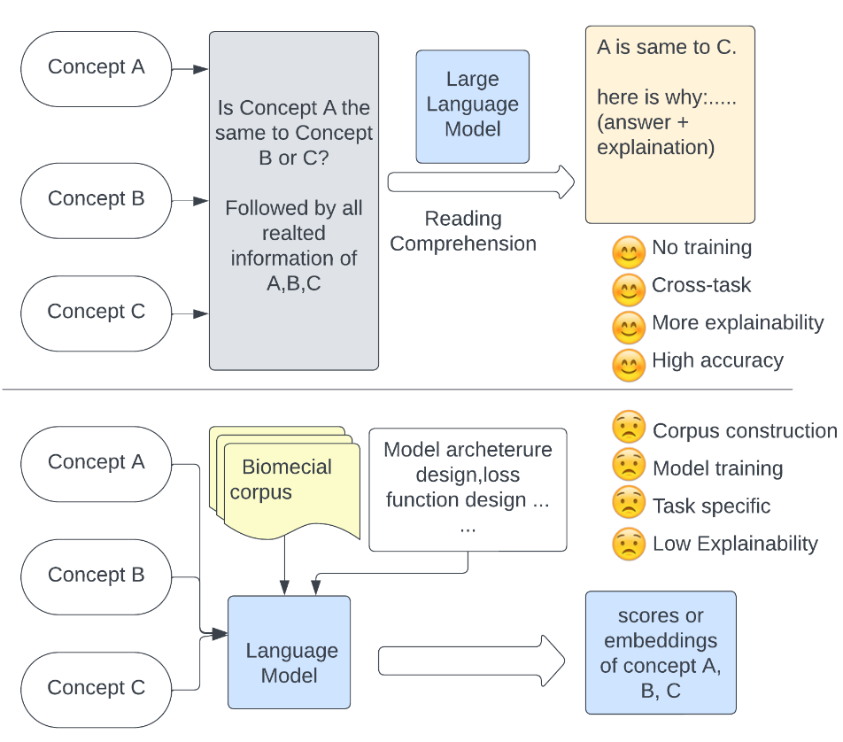
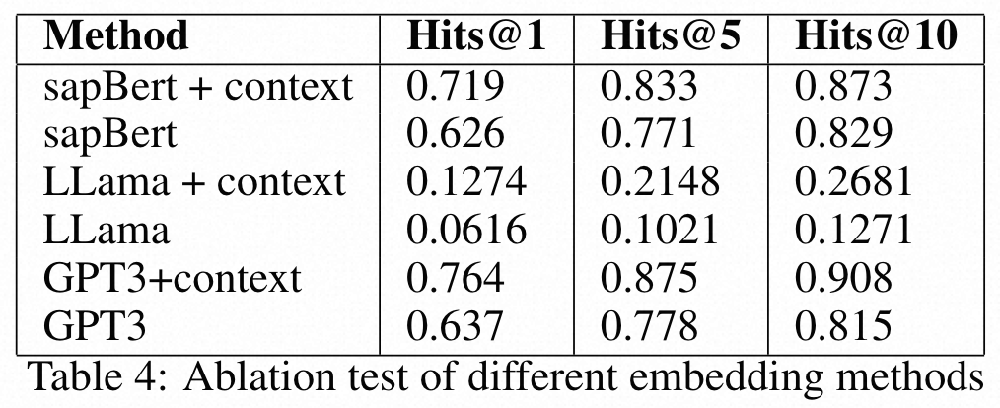
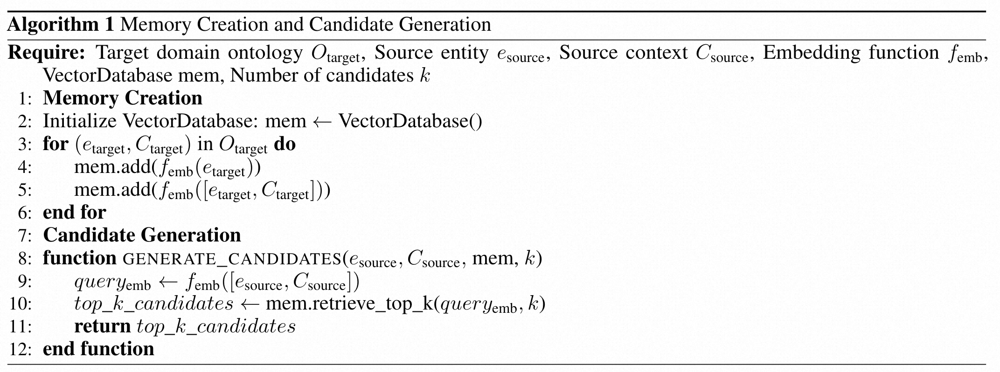
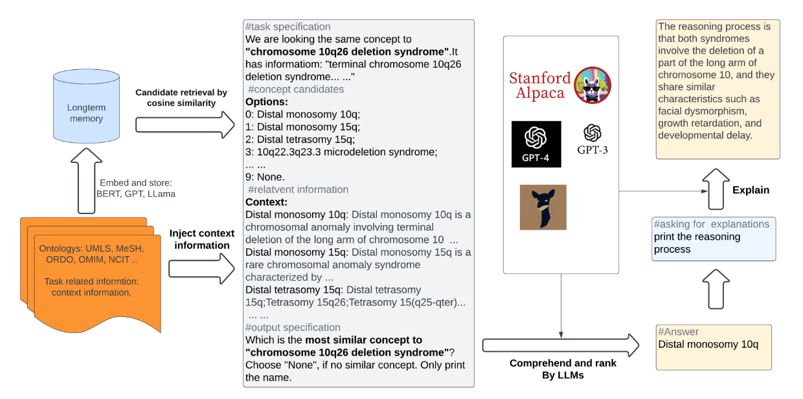
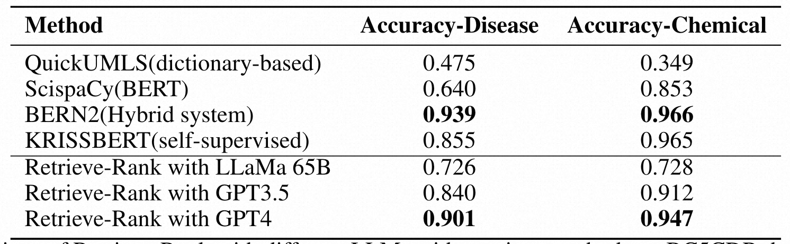
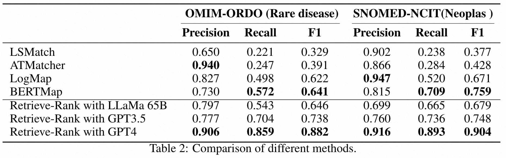
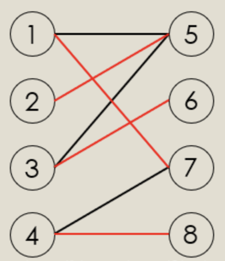

# 探索在生物医学概念链接方面大语言模型的情景学习能力

EXPLORING THE IN-CONTEXT LEARNING ABILITY OF LARGE LANGUAGE MODEL FOR BIOMEDICAL CONCEPT LINKING

## 摘要

本文探索了大语言模型的情景学习能力在生物医学概率链接上的应用。

两阶段框架：
* retrieve（提取）
  * 采用语言模型将生物医学概念进行嵌入
* rank（排名） 
  * 利用嵌入的相似度排名提取靠前的候选者
  * 候选者的上下文信息被纳入提示词（prompt），通过大语言模型进行处理，并重新对这些概念排序

BC5CDR数据集的精确率
* 疾病实体规范化：90.1% disease
* 化学实体规范化：94.7% chemical

## 简介

在生物医学领域，名词更新迭代速度快，概念数量众多，采用人工标注的方式进行训练是不可行的。

模型目标：
* 不需要针对特定任务的训练数据
* 能够处理复杂且模糊的生物医学概念

生物医学概念链接的三个阶段
* 生物医学实体链接（biomedical entity linking）
* 疾病名称规范化（disease name normalization）
* 本体匹配（ontology matching）

下图是本文提出方法和之前方法的对比图



* 基于BERT的方法
  * 需要对不同的数据集和任务进行微调
* 情境学习
  * 通过类比学习

优势
* 演示以自然语言呈现，具有与LLM交互的界面，知识纳入简单
* 语境学习是一种无需训练的学习框架，缩短模型适应新任务的开发时间
  
## 背景

### 实体链接与实体规范化

例子
* 将某一类特定的药品链接到drug ID
* 将某一种疾病链接到对应的disease ID / symptom ID

生物医学汇编词典
* The Unified Medical Language System（UMLS）
* 超过4百万实体，是生物医学领域的典范
* 目前所使用的MetaMap系统是一个基于规则的链接方法

### 本体匹配

定义：在不同的本体系统（知识库）中识别出对应的实体或概念

应用：异构数据库集成

方法：
* 传统方法：利用词相似、结构相似或者语义相似
* 深度学习方法：采用Transformer模型，尤其是BERT

以往方法的不足：
* 生物医学需要专家级的概念理解，BERT还做不到
* BERT需要对数据集再训练

## 模型方法

目标：
* 将源上下文$C_{source}$中的实体e映射到目标上下文$C_{target}$中的实体，即 $(e_{source}, C_{source}) \to (e_{target}, C_{target})
* 源实体可能来源于文本、图像、或者知识库，也可能缺失。但我们需要根据 上下文提供一个目标概念的语境

假设：
* 没有提及的样本或者标签数据是可以直接获得的（为了零训练学习）
* 目标实体的文本也没有打标签

输出：
* 为每个概念提供 唯一标识符、规范名称、描述 的概念列表

阶段：
* 文本嵌入（text embedding）
* 候选生成（candidate generation）
* 大语言模型实体排序（rank by LLM）

### 文本嵌入

目标：将文本数据转换为语义表示

为了满足无需训练的要求，本文实验了三种不同的嵌入模型
* SapBERT
  * 针对生物医学领域设计的自对齐与训练BERT模型
* LLaMa
  * 用于大语言模型嵌入的开源模型，适用性高
* GPT-3 （text-embedding-ada-002）
  * 一种有效的嵌入模型



从OMIM-ORDO两个知识库之间匹配的结果来看，SapBERT仅比GPT-3表现低3%，说明BERT模型未来可期。LLaMa模型的效果不尽人意。

考虑目标本地O和嵌入模型函数f，我们为每个实体生成文本嵌入。

输出
* 标准概念名称的嵌入（entity-name-only）
  * 用于能够通过字符串比较来提取或简单匹配的场景
* 包含名称和上下文综合信息的嵌入（entity-name-context）
  * 用于更加复杂的目标，虽然名称不同，但描述相似

### 候选实体生成

* 将知识库中的所有实体的嵌入存入长期记忆存储的向量数据库中
* 对于查询文本的嵌入，将其与数据库中所有向量计算余弦相似度
* 根据余弦相似度排序，返回最相似的前K个实体



### 候选实体排序

思路
* 向大语言模型提供与生物医学概念链接任务相关的上下文信息
* 让大语言模型进行阅读理解，并从给定的选项中选择最佳答案

prompt具体做法
* 先定义任务，告诉模型我们的目标是判别相似概念
* 然后展示候选概念以及它们的描述
* 最后让模型选择和查询概念最相近的选项，如果没有合适的，则输出None

### 整体框架



## 实验结果

BC5CDR数据集上检索排名（Retrieve-Rank）的实验结果
* 输入查询内容，模型返回前N个结果。判断真实结果是否包含在其中，衡量指标有精确率和召回率，还有F1



知识库之间实体匹配的实验结果



## 心得体会

创新之处不足，在词嵌入、候选实体生成等方面都是已有方法。

感觉不够自动化，单纯把大语言模型引入，候选实体排序里主要贡献在prompt工程。

当然，从作者展现的实验结果来看，好像还可以。

## 背景介绍

### 生物医学

生物医学领域在许多方面都十分依赖概念链接（concept linking），比如：文献挖掘（literature mining）、图对齐（graph alignment）、信息抽取（information retrieval）、问答、知识集成（knowledge integration）等。

虽然大语言模型已经在自然语言处理的许多领域有了很好的表现，但是在生物医学概念匹配上还没有被很好地探索。

### 疾病词标准化

疾病词的标准化（Disease Name Normalization）是一个非常复杂的任务，疾病词通常是由希腊和拉丁的词根和词缀构造的，比如hemochromatosis（血色素沉着病）。另一种灵活的疾病词创建方式是疾病分类（disease category）加上短修饰词（modifier）。

详见[利用成对学习排名进行疾病名称标准化](zh-cn/利用成对学习排名进行疾病名称标准化)

### 二分图匹配

#### 二分图

二分图又称作二部图，是图论中的一种特殊模型。 设G=(V,E)是一个无向图，如果顶点V可分割为两个互不相交的子集(A,B)，并且图中的每条边（i，j）所关联的两个顶点i和j分别属于这两个不同的顶点集(i in A,j in B)，则称图G为一个二分图。简而言之，就是顶点集V可分割为两个互不相交的子集，并且图中每条边依附的两个顶点都分属于这两个互不相交的子集，两个子集内的顶点不相邻。



#### 二分图匹配

给定一个二分图G，在G的一个子图M中，M的边集{E}中的任意两条边都不依附于同一个顶点，则称M是一个匹配。极大匹配(Maximal Matching)是指在当前已完成的匹配下,无法再通过增加未完成匹配的边的方式来增加匹配的边数。最大匹配(maximum matching)是所有极大匹配当中边数最大的一个匹配。选择这样的边数最大的子集称为图的最大匹配问题。如果一个匹配中，图中的每个顶点都和图中某条边相关联，则称此匹配为完全匹配，也称作完备匹配。求二分图匹配可以用最大流(Maximal Flow)或者匈牙利算法(Hungarian Algorithm)。

#### 二分图判断

对于二分图的问题我们首先要判断一个图它是不是二分图。对于二分图的判断方法最常见的是染色法，顾名思义就是我们对每一个点进行染色操作，我们只用黑白两种颜色，问能不能使所有的点都染上了色，而且相邻两个点的颜色不同，如果可以那么这个图就是一个二分图，对于判断是否是一个二分图的方法可以用dfs和bfs两种方式去实现。下面我就上一个bfs的判断二分图的代码。

```c++
vector<int> G[maxn];  // 存边
int col[maxn];        // 标记顶点颜色
int n,m;         // 点和边的个数
bool bfs(){
  queue<int> q;
  q.push(1);     // 放入第一个点
  memset(col,0,sizeof(col));
  col[1] = 1;    // 先标记第一个点为1
  while(!q.empty()){
    int v = q.front();
    q.pop();
    for(int i=0;i<G[v].size();i++){
      int xx = G[v][i];
      if(col[xx] == 0){      // 判断这个点是否标记过
        col[xx] = -col[v];   // 没有标记过就标记上与v相反的颜色
        q.push(xx);
      }
      else{
        if(col[v] == col[xx]){    // 如果颜色冲突说明不是二分图
          return false;
        }
      }
    }
  }
  return true;
}
```

#### 二分图最大匹配

给定一个二分图 G，即分左右两部分，各部分之间的点没有边连接，要求选出一些边，使得这些边没有公共顶点，且边的数量最大。

##### 增广路算法 Augmenting Path Algorithm

因为增广路长度为奇数，路径起始点非左即右，所以我们先考虑从左边的未匹配点找增广路。 注意到因为交错路的关系，增广路上的第奇数条边都是非匹配边，第偶数条边都是匹配边，于是左到右都是非匹配边，右到左都是匹配边。 于是我们给二分图 定向，问题转换成，有向图中从给定起点找一条简单路径走到某个未匹配点，此问题等价给定起始点 s 能否走到终点 t。 那么只要从起始点开始 DFS 遍历直到找到某个未匹配点，O(m)。 未找到增广路时，我们拓展的路也称为 交错树。

```c++
struct augment_path {
  vector<vector<int> > g;
  vector<int> pa;  // 匹配
  vector<int> pb;
  vector<int> vis;  // 访问
  int n, m;         // 两个点集中的顶点数量
  int dfn;          // 时间戳记
  int res;          // 匹配数

  augment_path(int _n, int _m) : n(_n), m(_m) {
    assert(0 <= n && 0 <= m);
    pa = vector<int>(n, -1);
    pb = vector<int>(m, -1);
    vis = vector<int>(n);
    g.resize(n);
    res = 0;
    dfn = 0;
  }

  void add(int from, int to) {
    assert(0 <= from && from < n && 0 <= to && to < m);
    g[from].push_back(to);
  }

  bool dfs(int v) {
    vis[v] = dfn;
    for (int u : g[v]) {
      if (pb[u] == -1) {
        pb[u] = v;
        pa[v] = u;
        return true;
      }
    }
    for (int u : g[v]) {
      if (vis[pb[u]] != dfn && dfs(pb[u])) {
        pa[v] = u;
        pb[u] = v;
        return true;
      }
    }
    return false;
  }

  int solve() {
    while (true) {
      dfn++;
      int cnt = 0;
      for (int i = 0; i < n; i++) {
        if (pa[i] == -1 && dfs(i)) {
          cnt++;
        }
      }
      if (cnt == 0) {
        break;
      }
      res += cnt;
    }
    return res;
  }
};
```

##### 网络最大流模型

二分图最大匹配可以转换成网络流模型。

将源点连上左边所有点，右边所有点连上汇点，容量皆为 1。原来的每条边从左往右连边，容量也皆为 1，最大流即最大匹配。

如果使用 Dinic 算法 求该网络的最大流，可在 $O(\sqrt{n}m)$ 求出。

Dinic 算法分成两部分，第一部分用 O(m) 时间 BFS 建立网络流，第二步是 O(nm) 时间 DFS 进行增广。

但因为容量为 1，所以实际时间复杂度为 O(m)。

接下来前 $O(\sqrt{n})$ 轮，复杂度为 $O(\sqrt{n}m)$。$O(\sqrt{n})$ 轮以后，每条增广路径长度至少 $\sqrt{n}$，而这样的路径不超过 $\sqrt{n}$，所以此时最多只需要跑 $\sqrt{n}$ 轮，整体复杂度为 $O(\sqrt{n}m)$。

代码可以参考 Dinic 算法 的参考实现，这里不再给出。


### 自对齐

Principal-Driven Self-Alignment of Language Models from Scratch with Minimal Human Supervision

大语言模型（LLM）除了性能强大之外，可靠且符合道德伦理也至关重要。为了确保大语言模型实现这些目标，需要它们的输出与人类的意图保持一致。我们通常把这个任务称为对齐（alignment）。

为了满足这一需求，ChatGPT 等近期的 AI 助理主要使用的方法包括用人类注释来进行监督式微调以及基于人类反馈来进行强化学习。但是，依赖人类数据会极大限制 AI 助理发挥出真正潜力，因为获取人类监督的成本不低，还存在涉及质量、可靠性、多样性、自我一致性和不良偏见等相关问题。

为了解决这些难题，卡内基梅隆大学语言技术研究所、IBM 研究院 MIT-IBM Watson AI Lab 和马萨诸塞大学阿默斯特分校的研究者提出了一种全新方法：SELF-ALIGN（自对齐）。该方法结合了原则驱动式推理和 LLM 的生成能力，从而使用极少的人类监督便能实现 AI 智能体的自对齐。从实验结果看，该方法的表现相当出色。

SELF-ALIGN 的设计目标是开发出有用、可靠且符合道德伦理的 AI 智能体，包括生成反对用户询问的答案，这能以不回避的方式主动应对有害查询，并且为该系统表示反对背后的原因提供解释。具体来说，该方法分为四个关键阶段：

1. （由主题引导的红队策略）自指示（Topic-Guided Red-Teaming Self-Instruct）：研究者采用了论文《Self-instruct: Aligning language model with self generated instructions》中提出的自指示（self-instruct）机制，其中使用了 175 个种子提示（prompt）来生成合成指令，另外还有 20 个特定主题的提示以确保指令能覆盖多样化的主题。这样的指令能确保全面覆盖 AI 系统所要学习的上下文 / 场景，并由此减少潜在的偏见。

2. 原则驱动式自对齐（Principle-Driven Self-Alignment）：研究者用英语定义了一个包含 16 条人工编写的原则的小型集合，其中包含系统所生成答复的理想质量以及 AI 模型在得到答案的行为背后的规则。这些原则的作用是引导 AI 模型生成有用、可靠且符合道德伦理的答复。研究者使用一些范例（演示）执行了在上下文中的学习（ICL、in-context learning），以此说明 AI 系统在不同情况下是如何在生成答复时遵守规则的。给定每个新查询，在答复生成过程中使用同样的范例集，而不是每次查询都使用不同的（人类标注的）范例。基于人工编写的原则、ICL 范例和传入的自指示提示，LLM 可以触发匹配规则，如果检测到查询是有害或不合规的，那么就可以为拒绝回答生成解释。

3. 原则刻画（Principle Engraving）：第三阶段是在自对齐答复上微调原始 LLM（基础模型），这些自对齐答复是 LLM 通过自我提示生成的，同时对微调后的模型执行了原则和演示的剪枝操作。这个微调过程让该系统可以直接生成很好对齐的答复，即这些答复是有用、可靠且符合道德伦理的；并且由于有共享的模型参数，因此在多种不同问题上都能得到对齐的结果。请注意，即使不明确使用原来的原则集和 ICL 范例，经过微调的 LLM 也能为新查询直接生成高质量的答复。

4. 冗长克隆（Verbose Cloning）：最后，研究者使用上下文蒸馏（context distillation）来增强系统的能力，使其能产生比简短或间接答复更全面和详细的答复。

### 生物医学名词解释

oncology：肿瘤学 

### 英文单词

nuance：细微差别，细微
* nuanced equivalences：微妙的等价关系，只有细微差别的等价

realm：领域，境界，范围，王国
* the realm of biomedical concepts：生物医学概念领域

