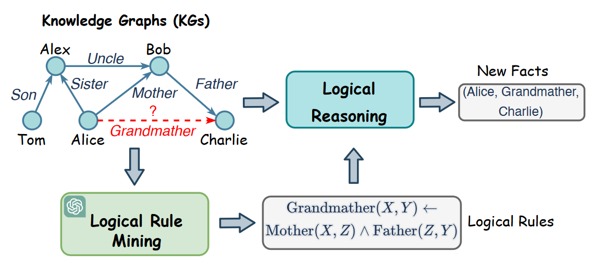
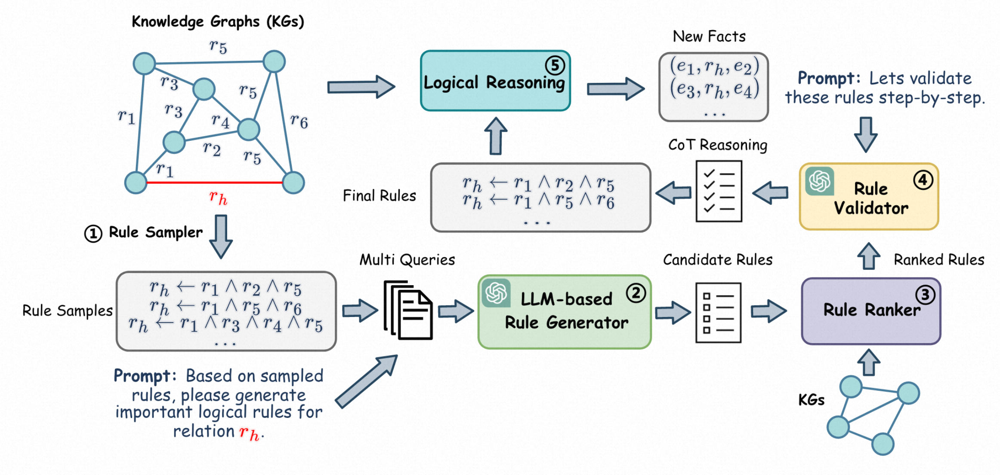
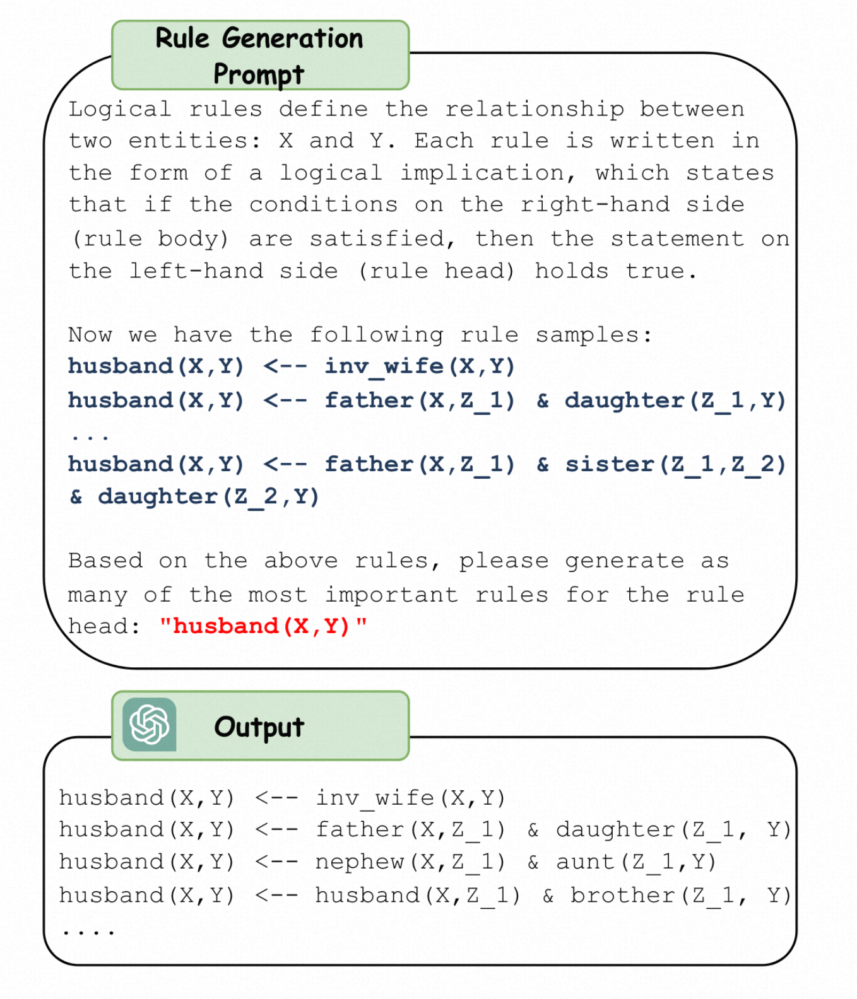
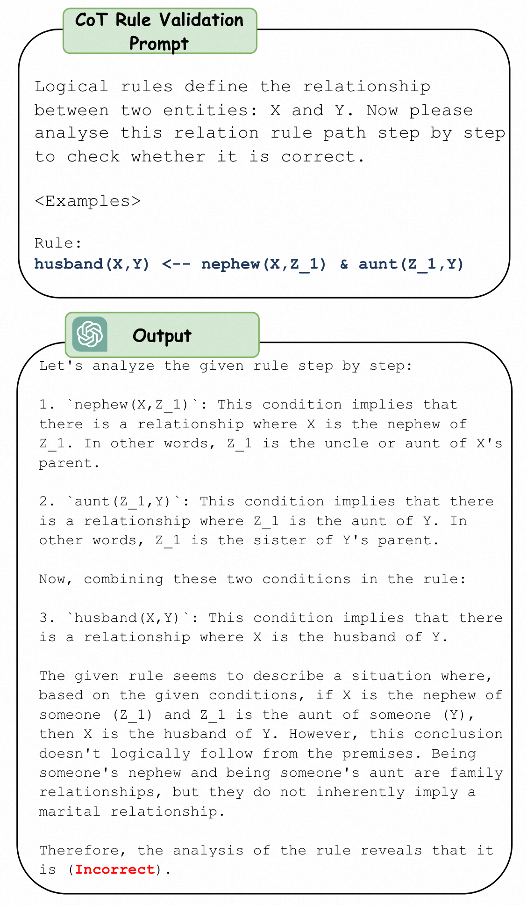

# 借助大语言模型挖掘用于知识图谱推理的逻辑规则

——挖掘知识图谱推理逻辑规则的又一新篇

## 摘要

逻辑规则对于发现关系中的潜在逻辑连接十分重要，能够提升知识图谱的推理性能和提供可解释的结果。

虽然已经有许多方法应用于挖掘知识图谱中的逻辑规则，但现有方法深受在规则空间中密集计算搜索的困扰，使其难以在大规模知识图谱中应用。此外，这些方法通常忽略了在发掘逻辑连接中很重要的关系的语义。

逻辑规则重要性
* 提高推理性能
* 在知识图谱上提供可解释的结果。

现有方法的不足
* 采用搜索策略，计算量过大，难以在大规模知识图谱中应用
* 忽略关系自身语义

本文借助大语言模型的力量挖掘逻辑规则。
* 采用基于LLM的规则生成器初始化，同时利用知识图谱的语义信息和结构信息来提示LLM生成逻辑规则
* 通过结合已有的知识图谱对规则进行排序，以此来对规则生成进行精细化调优
* 最后，一个规则验证器来约数LLM的推理并基于思维链来验证逻辑关系

## 介绍

定义
* 知识图谱：以结构化格式存储真实世界知识
* 图谱推理：从现有事实中推导新的知识

背景
* 可解释性知识图谱推理能够帮助用户理解推理过程、增加可信度，在医学诊断、法律裁决中有重要作用

示例

* 在上图中，我们知道逻辑规则 GrandMather(X, Y ) ← Mother(X, Z) ∧ Father(Z, Y )，可以用其预测知识图谱中所缺失的 Grand-Mather 关系的事实。

因此，逻辑规则（logical rule）的挖掘在推理中非常重要。

早期关于逻辑规则挖掘的研究通常通过发现KG结构中**频繁出现的模式**来找到逻辑规则。然而，它们通常需要枚举KG上所有可能的规则，并**根据估计的重要性对其进行排序**。

尽管最近的研究提出使用**深度学习方法对规则进行排序**。这些方法仍然受限于对规则的穷举，无法扩展到大规模KG。 

最近一些方法解决了这一问题，它们从KG中抽取路径，并对其进行模型训练，以捕捉形成规则的逻辑联系。但是，他们通常忽略了关系语义对表达逻辑联系的贡献。

例如：
我们知道一个人的"父亲"的"母亲"是他的"祖母"，据此以定义一条规则，如GrandMather(X,Y)←Mother(X,Z)∧Father(Z,Y)来表达逻辑联系。然而，**由于KG中的关系数量众多，要求领域专家为每个关系注释规则可能会造成负担**。因此，必须自动结合关系的结构和语义来发现KG中的逻辑规则。

最近，大型语言模型（LLM）凭借其突现能力和泛化能力，在自然语言处理领域和各种应用中表现出了令人印象深刻的性能。**经过大规模语料库的训练，LLMs存储了大量常识性知识，可用于促进KG推理，但LLMs并非为理解KG的结构而设计，因此很难直接应用它们来挖掘KG的逻辑规则。**此外，公认的**幻觉问题**也会使LLM生成毫无意义的逻辑规则。

为了缩小大语言模型和逻辑规则挖掘之间的隔阂，我们提出啦ChatRule的框架，利用KG的寓意信息和结构信息促使LLM生成逻辑规则。具体的：

首先提出一种基于LLM的规则生成器，为每个关系生成候选规则，从KG中抽取一些路径来表示结构信息，然后将其用于精心设计的提示中，从而利用LLM的能力进行规则挖掘。

为了减少幻觉问题，设计了一个逻辑规则排序器来评估生成规则的质量，并通过囊括KG中观察到的事实来过滤没有意义的规则。在逻辑推理阶段进一步使用质量分数，以减少低质量规则的影响。

最后，为了去除由KG支持但逻辑上不正确的虚假规则，利用LLM的逻辑推理能力，通过思维链（CoT）推理用规则验证器验证规则的逻辑正确性。

在本文的框架中，所挖掘的规则可以不经过训练而直接用于下游任务。在四个大型知识图谱上的额外实验也验证了ChatRule显著提升了知识图谱补全和规则质量评估任务的性能，达到state-of-the-art。

## 相关工作

### 逻辑规则挖掘

定义：从知识图谱中提取有意义的规则

传统方法
* 遍历所有候选规则，计算权重分数来评估规则质量
  * AIME，一种传统的逻辑规则挖掘方法，它通过归纳逻辑编程从KG中发现规则；
  * NeuralLP，一种归纳逻辑编程方法，它以端到端的差分方式学习逻辑规则；
  * DRUM，利用LSTM和注意力机制扩展了NeuralLP，以挖掘可变长度的规则；
* 借助深度学习，以不同方式同时学习逻辑规则和权重
  * 这些方法仍然要对规则空间进行大量优化，这限制了它们的可扩展性。
* 从KG中抽样路径并训练模型来学习逻辑连接的方法
  * RLvLR从子图中采样规则，并提出一种基于嵌入的分数函数来估计每条规则的重要性。
* RNNLogic将规则生成和规则加权分开，这可以相互促进，减少搜索空间。
* R5提出了一种强化学习框架，可启发式地搜索KG并挖掘底层逻辑规则
* RLogic和NCRL可预测规则体的最佳构成，是该领域最先进的方法

### 大语言模型

许多LLM和LLaMA都被证明在各种任务上的有效性。

为了更好地利用LLM的潜能，研究人员通过少量样本或者推理的思维链设计了一些提示词来最大化LLM的能力。

但目前没有为逻辑规则挖掘设计的提示词。

## 前提与问题定义

* 知识图谱：一组三元组（e，r，e'）的集合
* 逻辑规则：一阶逻辑（一阶谓词演算）的特例
  * 形式：$\rho = r_h (X, Y) \leftarrow r_1 (X, Z_1) \wedge \cdots \wedge r_L(Z_{L-1}, Y)$
  * $body(\rho) = r_1 (X, Z_1) \wedge \cdots \wedge r_L(Z_{L-1}, Y)$表示一系列规则的合取，被称为rule body（规则体）
  * $r_h (X, Y)$则被称为rule head（规则头）
  * L表示规则的长度
  * 当规则主题的条件都满足时，规则头也成立
* 规则实例：将规则中的X、Y、Z替换为KG中的实体

逻辑规则挖掘任务
* 给定目标关系$r_h \in R$，找到一组描述了其他关系中逻辑连接的有意义的规则$P_{r_h} = \{ \rho_1, \cdots, \rho_K \}$来表达知识图谱中的目标关系

## 方法

整个框架由3部分构成：
* 一个基于LLM的规则生成器
* 一个评估在知识图谱上生成规则质量的规则排名器
* 一个用于验证逻辑规则正确性的思维链规则验证器

### 基于LLM的规则生成器

#### 规则采样

对于任意给定的三元组（e1，rh，el），通过广度优先搜索（BFS）找到其中的封闭路径e1 -r1-> e2 -r2-> ... -rL-> eL

#### 基于LLM的规则生成

对于采样所得的每一条规则rh，将其转换为自然语言表述的语句输入给LLM，让LLM根据规则产生推理出的新的规则。

相关提示词设计见下图所示：

#### 基于LLM的规则总结

当然，由于提示词长度限制，规则的输入需要分组完成。最后对所有生成的规则进行汇总。

### 逻辑规则排序

由于LLM具有幻觉，生成的规则并不都是正确的，我们通过对其基于KG事实进行排序来检测幻觉和评估生成规则的质量。

规则排序器（rule ranker）的目标是为候选规则集中的每一个规则赋予一个分数$s(\rho)$。本文采用了4种评价指标：
* support
  * 定义：知识图谱中满足规则的事实数量
  * $support(\rho) = #(e, e'): body(\rho) \wedge (e, r_h, e') \in G$
  * zero support的规则可以直接丢弃
  * 是绝对数量，在拥有更多事实的KG中分数会更高，是有偏的
* coverage
  * 定义：将KG的support对KG中事实的数量作归一化
  * $coverage(\rho) = \frac{support(\rho)}{#(e, e'): (e, r_h, e') \in G}$
  * 衡量的是比例
* confidence
  * 定义：满足规则$\rho$的事实数量与在KG中用到了规则体$\text{body}(\rho)$的次数之比
  * $confidence(\rho) = \frac{support(\rho)}{#(e, e'): \text{body}(\rho) \in G}$
  * 需要假定所有推导出来的规则体都在KG中（否则分母为0）
  * 但实际上很多KG本身就是不完备的，有事实的缺失
* PCA confidence
  * 定义：满足规则$\rho$的事实数量与规则体$\text{body}(\rho)$在部分完全的KG中被使用的次数之比
  * $PCA confidence(\rho) = \frac{support(\rho)}{#(e, e'): \text{partial}(\rho)(e, e') \in G}$
  * 其中关于partial complete KG的定义为：$\text{partial}(\rho)(e, e') = (e, r_1, e_2) \wedge \cdots \wedge (e_{L-1}, r_L, e''): body(\rho) \wedge (e, r_h, e'')$
  * 并非基于规则体所推到出的整个集合的数量，而是基于我们所知道的真的事实的数量和我们假设为假的事实的数量
  * **PCA confidence评估规则的质量和泛化性是较好的**，后续实验也支持了这一观点

### 采用CoT推理用于规则验证

在规则排序之后，我们得到了一组由目标关系$r_h$所衍生出的规则集合。

在所有生成的规则中，除了要删去没有得到支持的那些规则之外，因为知识图谱中的噪音而产生的“伪规则”（spurious rules）也是需要去除的。伪规则虽然能够得到知识图谱中事实的支持，但是中逻辑上是错误的，并将导致下游任务错误的预测。

为此，我们利用LLM的推理能力，采用思维链推理来验证逻辑正确性。

对于每一个规则$\rho \in R_{r_h}$，将其输入CoT提示词模版，并询问LLM来验证逻辑正确性。

提示词示例如下：

prompt: 
* Logical rules define the relationship between two entities: X and Y. Now please analyse this relation rule path step by step to check whether it is correct.

### 基于规则的逻辑推理

最终，规则将用于逻辑推理以解决下游任务。例如：知识图谱补全等。

对于查询$(e, r_h, ?)$，设A是所有候选答案的集合。对于候选集合中的每一个候选者$e' \in A$，应用规则$P_{r_h}$来计算分数：

$$
\text{score}(e') = \sum_{\rho in P_{r_h}} \sum_{\text{body}(\rho) (e, e') in G} s(\rho)
$$

其中，$\text{body}(\rho) (e, e')$表示在KG中满足规则体的路径，$s(\rho)$是规则$\rho$的质量分数（可能采用converge，confidence或者PCA confidence中的一种作为评价标准）。

计算后，对所有候选者排序，取出top-N个答案作为最终的答案。

## 总结

这篇文章将两者进行结合，利用大模型挖掘知识图谱上的逻辑规则，利用LLM的重读能力和KG的结构信息进行规则生成、规则排序和规则验证。
