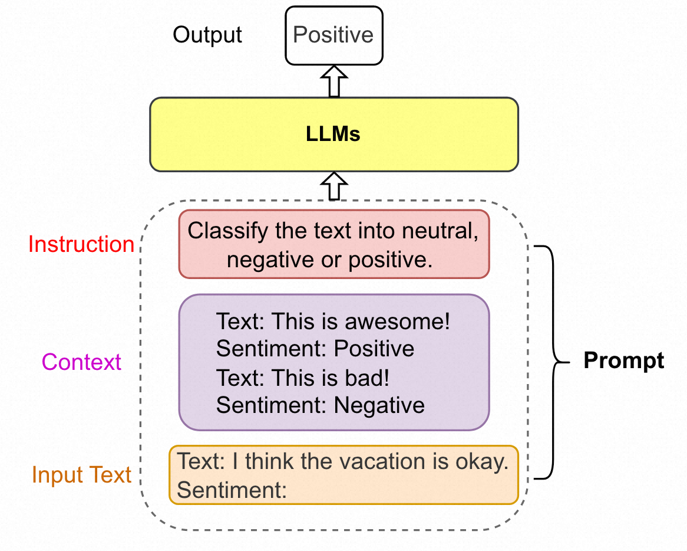

# 统一大语言模型和知识图谱综述

Unifying Large Language Models and Knowledge Graphs: A Roadmap

## 摘要

**大型语言模型**（LLM），如ChatGPT和GPT4，由于其**涌现能力**和**泛化性**，正在自然语言处理和人工智能领域掀起新的浪潮。然而，LLM是**黑箱模型**，通常**无法捕捉和获取事实知识**。相反，**知识图谱**（KGs），例如维基百科和华普，是显式存储丰富**事实知识**的结构化知识模型。KGs可以通过为推理和可解释性提供外部知识来增强LLM。同时，KGs很难从本质上构建和演化，这对KGs中现有的生成新事实和表示未知知识的方法提出了挑战。因此，将LLM和KGs统一在一起并同时利用它们的优势是相辅相成的。在本文中，我们提出了LLM和KGs统一的前瞻性路线图。我们的路线图由三个通用框架组成，即：1）KG增强的LLM，它在LLM的预训练和推理阶段纳入了KG，或者是为了增强对LLM所学知识的理解；2） LLM增强的KG，利用LLM执行不同的KG任务，如嵌入、补全、构建、图到文（graph-to-text）生成和问答；以及3）协同LLM+KGs，其中LLM和KGs扮演着平等的角色，并以互利的方式工作，以增强LLM和KG，实现由数据和知识驱动的双向推理。我们在路线图中回顾和总结了这三个框架内的现有努力，并确定了它们未来的研究方向。

## 背景

### LLM

现有的LLMs可以分为

1）Encoder-only LLMs：

仅编码器LLM，如BERT[1]、ALBERT[51]、RoBERTa[2]和ELECTRA[52]，需要添加额外的预测头来解决下游任务。

2）Encoder-Decoder LLMs：

例如，T5[3]是通过掩蔽和预测掩蔽词的跨度来预训练的。UL2[55]统一了几个训练目标，例如不同的掩蔽跨度和掩蔽频率。编码器-解码器LLM（例如T0[56]、ST-MoE[57]和GLM-130B[58]）能够直接解决基于某些上下文生成句子的任务，例如总结、翻译和问答。

3）Decoder-only LLMs：

这些模型的训练范式是预测句子中的下一个单词。

### Prompt engineering

提示词工程是一个新的领域，其聚焦于创造和改进提示词以最大化利用大语言模型。

提示可以包含几个元素，即1）指令(instruction)、2）上下文(context)和3）输入文本(input text)。指令是指示模型执行特定任务的短句。上下文为输入文本或少样本示例提供上下文。输入文本是需要由模型处理的文本。

### KG

现有的KGs可以分为

1） 百科KGs:

Wikidata[20]是使用最广泛的百科全书式知识图之一，它包含了从维基百科上的文章中提取的各种知识。其他典型的百科全书式知识图，如Freebase[67]、Dbpedia[68]和YAGO[31]，也源自维基百科。此外，NELL[32]是一个不断改进的百科全书式知识图，它自动从网络中提取知识，并随着时间的推移使用这些知识来提高其性能。有几种百科全书式的知识图谱以英语以外的语言提供，如CN-DBpedia[69]和Vikidia[70]。最大的知识图名为knowledge Occean（KO），目前包含487843636个实体和1731158349个中英文关系。

2）常识KGs:

ConceptNet[72]包含了广泛的常识性概念和关系，可以帮助计算机理解人们使用的单词的含义。ATOMIC[73]、[74]和ASER[75]关注事件之间的因果效应，可用于常识推理。其他一些常识性知识图，如TransOMCS[76]和CausalBanK[77]，是自动构建的，以提供常识性知识。

3）领域特定KGs:

例如，UMLS[78]是医学领域中的特定领域知识图谱，它包含生物医学概念及其关系。

4）多模态KGs:

例如，IMGpedia[85]、MMKG[86]和Richpedia[87]将文本和图像信息合并到知识图谱中。这些知识图谱可用于各种多模态任务，如图像文本匹配[88]、视觉问答[89]和推荐[90]。

## 统一LLM和KG

### 知识表示

KEPLER[40]提出了一个用于知识嵌入和预训练语言表示的统一模型。在KEPLER中，他们用LLM作为嵌入对文本实体描述进行编码，然后联合优化知识嵌入和语言建模目标。JointGT[42]提出了一种图-文本联合表示学习模型，该模型提出了三个预训练任务来对齐图和文本的表示。DRAGON[44]提出了一种自监督方法，从文本和KG中预训练联合语言知识基础模型。它以文本片段和相关的KG子图为输入，双向融合来自两种模式的信息。然后，DRAGON利用两个自监督推理任务，即掩蔽语言建模和KG链接预测来优化模型参数。HKLM[242]引入了一种统一的LLM，它结合了KGs来学习领域特定知识的表示。

### 推理

Reasoning

在问答任务中，QA-GNN[117]首先利用LLM来处理文本问题，并指导推理步骤。通过这种方式，它可以弥合文本和结构信息之间的差距，从而为推理过程提供可解释性。在知识图谱推理任务中，LARK[45]提出了一种LLM引导的逻辑推理方法。它首先将传统的逻辑规则转换为语言序列，然后要求LLM对最终输出进行推理。此外，siyuan等人[46]将结构推理和语言模式预训练统一在一个统一的框架中。给定文本输入，他们采用LLM来生成逻辑查询，该查询在KGs上执行以获得结构上下文。最后，将结构上下文与文本信息融合以生成最终输出。RecInDial[243]结合知识图谱和LLM，在对话系统中提供个性化推荐。KnowledgeDA[244]提出了一个统一的领域语言模型开发pipeline，以增强具有领域知识图谱的任务特定训练过程。

## 结论

将大型语言模型（LLM）和知识图谱（KGs）统一起来是一个活跃的研究方向，越来越受到学术界和工业界的关注。在这篇文章中，我们对该领域的最新研究进行了全面的概述。我们首先介绍了整合KGs以增强LLM的不同方式。然后，我们介绍了现有的将LLM应用于KG的方法，并基于各种KG任务建立了分类法。最后，我们讨论了这一领域的挑战和未来方向。我们希望本文能对这一领域有一个全面的了解，并推动未来的研究。