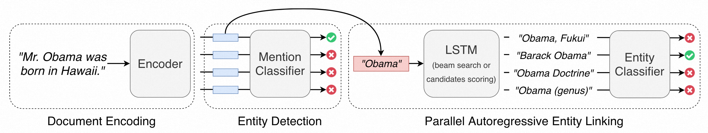
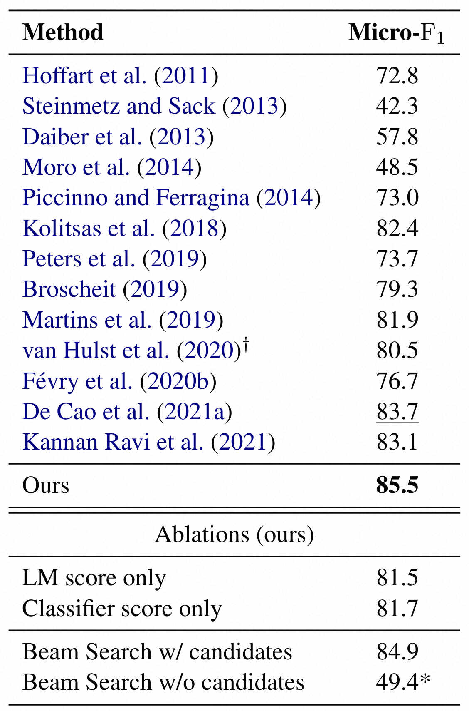
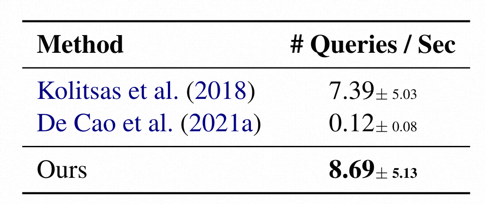
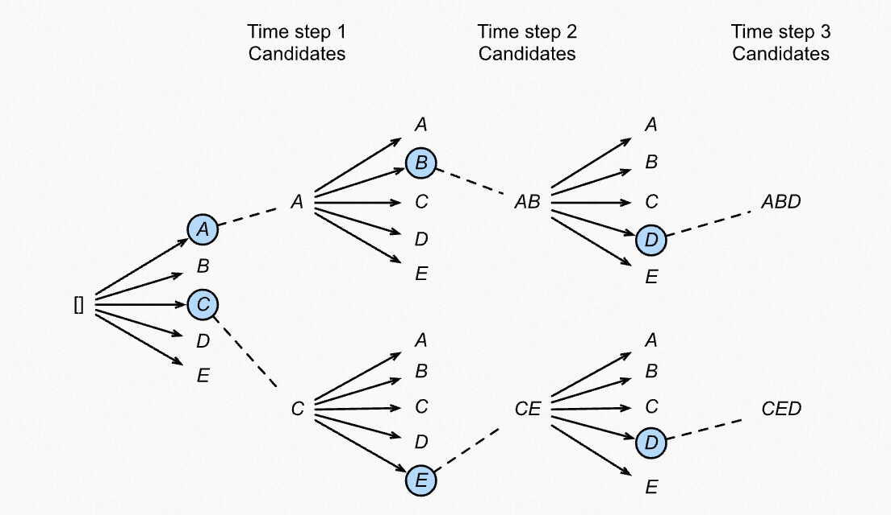

# 采用判别修正的高并行自回归实体链接

## 摘要

过往的实体链接自回归生成方法存在以下缺点：

1. 计算成本高昂（依赖复杂且深的Transformer解码器；Transformer无状态，随着序列变长内存空间增大）
2. 非并行化解码（自回归解码器，排除了across mention的并行）
3. 需要大规模数据训练

本文提出了将所有潜在的mention并行进行实体链接的方法，并依赖一个浅层且高效的解码器。

此外，在生成目标的基础上增加了一个额外的判别成分，即一个修正项，使其可以直接优化生成器的排序。

本文的模型解决了上述的缺点，并且比之前的生成模型快70倍以上且更加精确。在AIDA-CoNLL数据集上达到了state-of-the-art。

## 介绍

采用自回归语言模型可以更好地利用预训练过程中积累的隐含知识，充分利用实体及其上下文的全交叉编码器（full cross-encoder）

* 对于Entity Disambiguation：自回归生成表现得非常好
* 对于Entity Linking：虽然在许多数据集上达到了SOTA，但受到许多限制

本文重新审视了实体链接的**生成方法**，在给定输入的情况下，有条件地独立生成mention-entity对。

* 此方法通过使用一个浅层的LSTM decoder允许跨mention的并行。
* 为了更明确地优化生成器的排名，我们使用了一个判别性的修正项，该修正项推动正确预测的分数高于其余的分数。
* 为了支持长文本输入，采用了高效的Transformer encoder来支持长序列。

## 模型概览

一个基于Transformer的document encoder将文档嵌入向量中。然后mention detection模块识别文档中的mention span。在提及嵌入的条件下，实体链接模块首先使用LSTM来生成或为候选的文本标识符评分，然后使用分类器对所有候选者进行重新排序。

## 背景

* 实体链接
  * 在输入文本中找寻mention-entity对
* 相关工作
  * 大多数方法将MD和ED分开处理
  * 近来，端到端实体链接采用共享架构
  * 本文聚焦英语，有工作探索来跨语言实体链接
* 自回归链接
  * 不再将EL作为向量空间中的匹配问题，而将其作为sequence-to-sequence的序列到序列问题
    * 匹配mention向量到entity embedding：maximum inner-product search（MIPS）
    * 生成模型：
      * 利用预训练只是
      * 不需要存储预计算的实体表示，节省内存
      * 在上下文和实体上完全跨编码器

## 方法

根据输入的文档$x$，生成观察到的mention-entity对集合$\gamma$。其中，$\gamma$内的每一对mention-entity对都是相互独立的。

$$
p(\gamma|x, \theta) = \prod_{<m, e> \in \gamma} p(m | x, \theta_{MD}) p(e|m, x, \theta_{ED})
$$

* encoder: Longformer (Beltagy, 2020) 支持长序列
* mention detection:
  * 将一个mention span $(m_s, m_e)$出现的概率分解为以ms开始的概率以及在ms开始的前提下以me结尾的概率。$p(m|x, \theta_{MD}) = p(m_s | x, \theta_{MD}) * p(m_e | m_s, x, \theta_{MD})$，并将mention的长度限制在15个token之内 ($m_e - m_s + 1 < 15 $)
  * 在推理时，只考虑token作为mention起始的概率大约最大化验证集F1指标所设置的阈值的mention
* entity disambiguation:
  * 从左到右逐词自回归地生成实体e的唯一名称。$p(e|x, m, \theta_{ED}) = \prod_{i = 1}^{|t|} p(t_i | x, m, t_{<i}, \theta_{ED}) $
  * 为了充分并行，采用小型单层LSTM。该模型并非仅能够生成有效的实体名称，而且最大似然训练也不是直接优化生成排名。为此，本文使用了一个额外的基于判别式分类器的损失函数：$p(e|x, m, \theta_{ED}) = \frac{\exp (f(x, m, t; \theta_{ED}))}{\sum_c \exp (f(x, m, c; \theta_{ED}))}$
* 参数估计：采用随机梯度下降法（SGD）来联合优化各个部件使得模型的似然概率最大。

笔者补充：对于MD，常见的是对文本中所有可能的span进行打分，比如[基于BERT双编码器的one-pass端到端实体链接](zh_cn/基于BERT双编码器的one-pass端到端实体链接)就是这么做的。但这对于长文本来说，时间消耗与序列长度呈平方增长，对于长序列来说效率太低。本文的目标是长序列文本的高效实体链接，所以这个方法是并不合适的。

## 实验

采用标准英语的AIDA-CoNLL数据集，将其拆分用作训练、验证和测试。

体系细节：
* 文档编码器：Longformer，有着有限注意力窗口的RoBERTa模型。本来有12层，本文为了加快计算只使用了前8层，hidden size为768，一共12个head，总共149M的参数
* 指称检测（起始、结束token检测）：均采用前馈神经网络（feed forward NNs），架构为[LaryerNorm, 128, ReLU, LayerNorm, 1]，其中线性投影前的dropout为0.1
* 自回归实体消歧：由LSTM实现，3个前馈神经网络预测第一个hidden state，第一个context vector和一个附加到每个解码步骤的vector。预测是mention的start和end嵌入的函数
* 判别式分类器：一个前馈神经网络，以mention的向量表示和LSTM生产的最后 一个context vector作为输入

整个模型的参数量为202M，采用Adam优化器。整个训练在4个Nvidia Titan X 12GB的GPU上进行了大约1小时。

## 结果

总的来说，结果上是比以往的模型要好一些，但查询速度有所下降。

在AIDA测试集上的结果，以Micro-F1作为评价指标

推理速度：每个查询所需要的秒数

## 心得体会

本文的主要贡献应该是采用了生成方法来进行实体链接，利用LSTM解码器来并行。总的来说，还是一个将各个阶段拆分开来做的，encoder，mention classifier都是已有的方法；用LSTM进行beam search和候选词打分生成候选实体，并用entity classifier判断LSTM生成的实体是不是真正的实体。

## 补充阅读

### 名词解释：gold standard entity

gold standard entity 其实就是语料中标注的entity，也就是真实的entity标记， 可以理解为entity的ground truth。

比如：小明来到了北京天安门

gold standard entity： 北京天安门

predicted entity by model: 北京

真实标记的为实体为**北京天安门**，而模型识别出的**北京**。

论文中经常出现gold entity这个词, 用以与predicted entity作区分，因为一般在pipline模型中，train阶段输入的都是gold entity, 而在inference阶段，则输入的为predicted entity。

### 算法浅析：集束搜索（beam search）

beam作为名词时的意思是光束，横梁；作为动词时的意思是微笑，发光，播送，发射。

beam search和exhaustive search、greedy search等是相对应的概念，均是用于搜索的算法。

比如，对于已知总词汇量为c、对应文本长度为n的翻译问题：穷举搜索枚举所有$c^n$种组合，贪心算法每次寻找最优的词，只需要$n*c$种组合。

穷举搜索能够保证全局最优，但是搜索效率太低。而贪心搜索不能保证获得全局最优解，但是搜索效率大大提高。而集束搜索beam search，则是对贪心算法的一个改进。相对贪心搜索扩大了搜索空间，但远远不及穷举搜索指数级的搜索空间，是二者的一个折中方案。当然，beam search也不保证全局最优。

那么，beam search算法是怎样的呢？其实，贪心算法是beam search的一种特殊情况。对于beam search，我们在每次搜索时有一个beam size。不同于贪心算法，每次beam size都是1，只取最优的那一个解；在beam search中，算法会在每次搜索时选择当前搜索空间内最优的前beam size个解，并以此进一步拓展。

比如，对于beam size=2的情况，在上述搜索时，第一步找到前2个最优的词，然后在这两个词上组合得到的2c个组合中再选出最优的两种情况，进一步探索。

